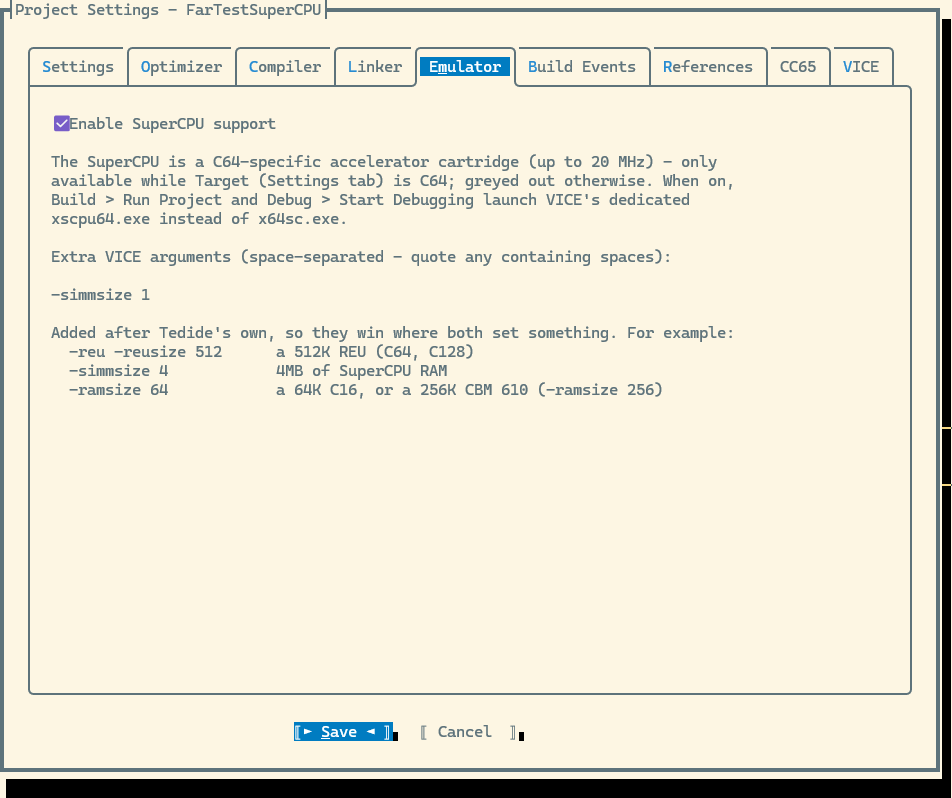
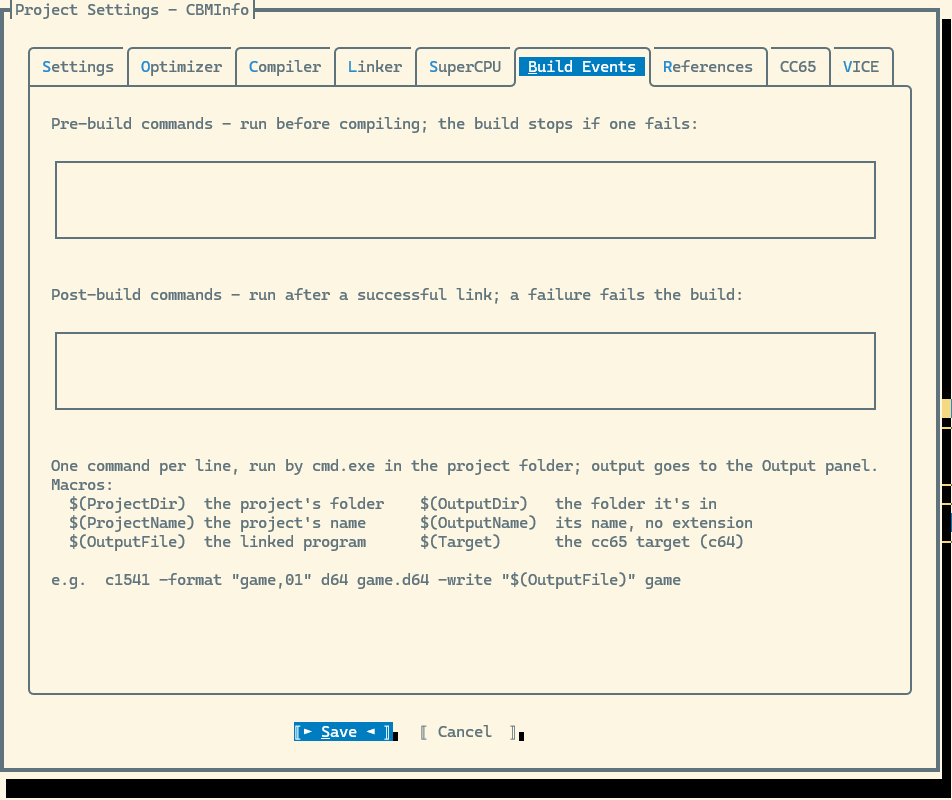
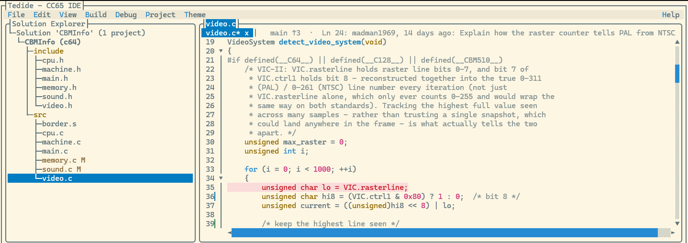
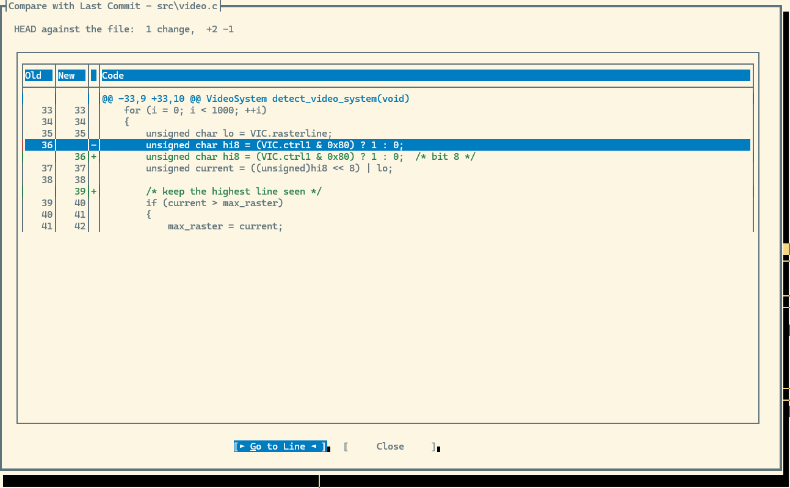
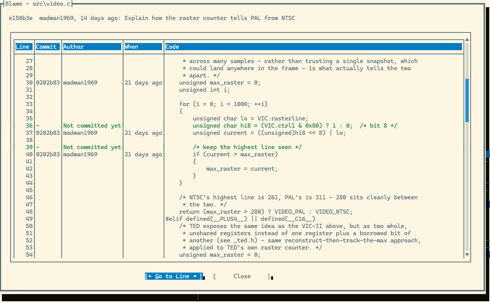
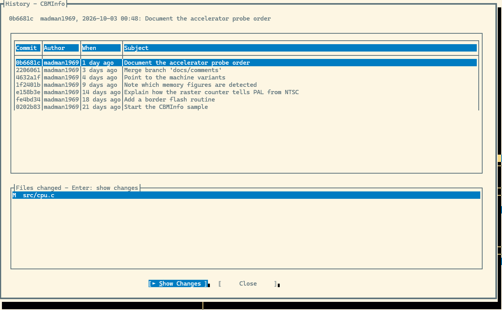
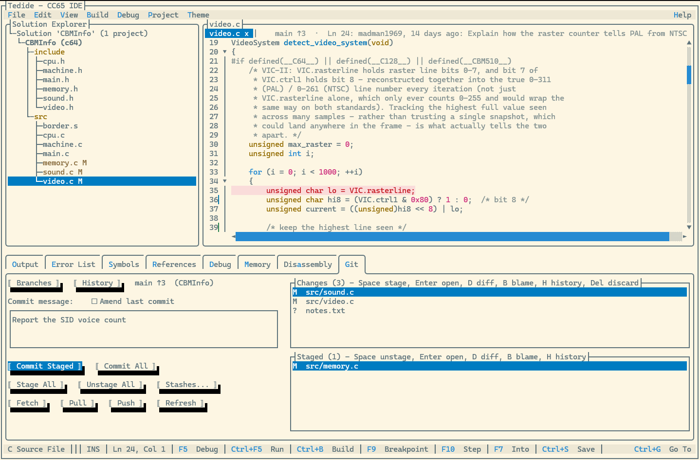
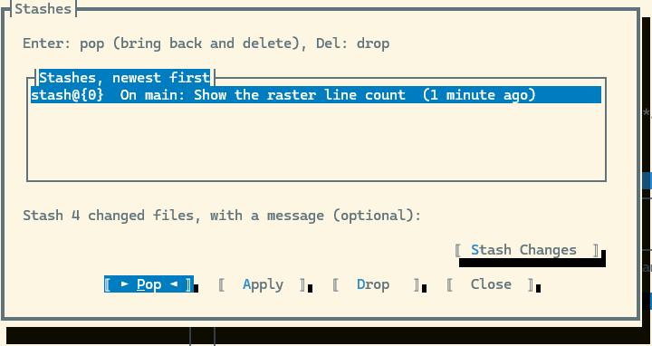
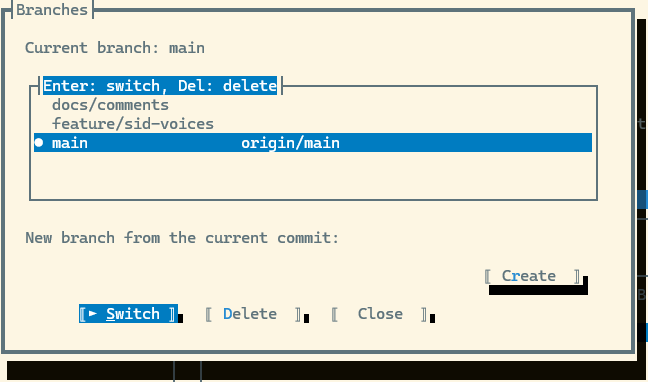
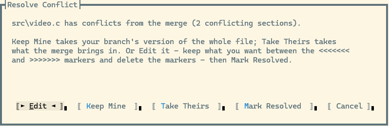

# Tedide


Tedide is a terminal IDE for [cc65](https://cc65.github.io/) development on Commodore 8-bit
machines, modelled loosely on Visual Studio. It has a Solution Explorer, a tabbed editor with 6502
syntax highlighting, builds driven by `cl65`, and source-level debugging in the VICE emulator.

A companion app, the **Doc Viewer**, browses the cc65 manuals and other Commodore references
offline.

## Features

### Projects and editing

- **Solutions and projects** - `.tsln`/`.tproj` files, New Project scaffolding for every Commodore
  target, multi-project solutions with library projects, project references and a startup project,
  and a Recent Projects and Solutions list.
- **Solution Explorer** - a folder tree of each project's sources, headers and linker configs, a
  Generated Files node, and right-click menus to add, rename and delete files, add projects, and
  build, clean, configure, remove or delete a project.
- **Tabbed editor** - syntax highlighting for C, 6502/ca65 assembly, listings, linker maps, VICE
  label files and linker configs; per-tab undo history; open tabs remembered per project.
- **Code completion** - names, struct members after `.` and `->`, ca65 directives and instructions
  as you type, and the signature of the call you're typing.
- **Errors as you type** - the file you're editing is checked by cc65 or ca65 whenever you pause,
  with problem lines underlined and listed in the Error List, without building.
- **Code navigation** - Go To Definition, Find All References and Rename Symbol across C and
  assembly, Navigate Backward/Forward, Find/Replace, Find in Files and Go To Line.
- **Visual Studio keys** - F5 debug, Ctrl+F5 run, Ctrl+B build, F9/F10/F12 and the Ctrl+Alt tool
  window keys, wherever Windows Terminal lets the key through.
- **Themes** - nine true-colour themes, shared with the Doc Viewer, including Borland Turbo C,
  Commodore 64 and Amber Phosphor.

### Build and run

- **Building** - per-file `cl65` builds with live output, an Error List, Build/Clean Solution,
  Cancel Build, and pre- and post-build commands.
- **Project Settings** - target, optimization, compiler and linker options, include paths and
  defines, SuperCPU support, build events and references, all in one dialog.
- **opt6502** - a built-in optimizer for cc65's generated assembly, favouring size or speed.
- **Running in VICE** - launches the emulator matching the target, with the right memory setup for
  the VIC-20, C16 and Plus/4.

### Debug

- **Source-level debugging** - over VICE's binary monitor: breakpoints (with conditions, and
  enable/disable), stepping by C line, and the debug state in the window title.
- **Debugger windows** - laid out like Visual Studio's: Locals and Watch beside Call Stack,
  Breakpoints and Registers, plus Memory and Disassembly tabs.
- **Symbols** - a filterable browser for the linker map and label file.

### Source control

- **In the editor** - status markers in the Solution Explorer, the branch and the caret line's
  blame above the editor, change bars in the gutter that follow unsaved edits, Compare with Last
  Commit, a full Blame view and a file's history.
- **The Git tab** - stage, unstage, discard, commit (or amend the last commit), stash, and fetch,
  pull and push.
- **Branches and history** - switch, create and delete branches, browse the repository's history,
  and resolve merge, rebase, cherry-pick and revert conflicts.

### Help and samples

- **Help** - F1 context help opens the bundled **Doc Viewer** at the word under the caret: the cc65
  manuals, The C Book, C64-Wiki, Wikipedia and the VICE manual, with full-text search and bookmarks.
- **Samples** - nine samples, from a bouncing-characters demo to a far-memory library for six
  machine setups.
- **Standalone builds** - publish Tedide and the Doc Viewer as single executables that need no .NET
  runtime installed.

## Contents

- [Getting started](#getting-started)
- [Samples](#samples)
- [Projects and solutions](#projects-and-solutions)
- [Editing](#editing)
- [Keyboard shortcuts](#keyboard-shortcuts)
- [Building and running](#building-and-running)
- [Project Settings](#project-settings)
- [Git](#git)
- [Debugging](#debugging)
- [The Doc Viewer](#the-doc-viewer)
- [Themes](#themes)
- [For contributors](#for-contributors)
- [Status](#status)

## Getting started

### Prerequisites

- .NET SDK 10.0 or later.
- The [cc65](https://cc65.github.io/) toolchain, with `cl65` on your `PATH`.
- [VICE](https://vice-emu.sourceforge.io) (optional) - needed to run and debug programs. Everything
  else, including building, works without it.

Tedide looks for VICE in `C:\GTK3VICE-3.9-win64\bin` by default. Change that on the **VICE** tab of
**Project > Settings**, and set `CC65_HOME` on its **CC65** tab. Both are saved once per machine and
apply to every project.

### Run it

```bash
dotnet run --project src/Tedide.App
```

Run it inside Windows Terminal for full colour. Then, from the **File** menu:

- **New Project...** creates a project from a name, a target and a folder - see
  [New projects](#new-projects).
- **Open Project...** opens a `.tsln` or `.tproj`, such as one of the [samples](#samples).
- **Open File...** opens any source files, with or without a project loaded. A file outside the
  project is edited, saved and [checked for errors](#errors-as-you-type) like the project's own,
  but isn't built; **Add Existing Item** in the Solution Explorer puts one in the project.
- **Recent Projects and Solutions** lists the last 10 you opened, numbered for Alt+1 to Alt+9 as in
  Visual Studio. An entry whose files have moved is dropped from the list with an error.
- **Close Project** closes the loaded projects, asking about unsaved files first. Nothing on disk
  changes.


## Samples

Open any of these with **File > Open Project...**:

| Sample | Target | What it shows |
| --- | --- | --- |
| `HelloCBM` | Every Commodore target | Several `.c`, `.h` and `.s` files, and per-target conditional compilation, so one project builds for every machine. |
| `HelloPlus4` | Plus/4 | TED chip features the C64 lacks: the 121-colour palette, TED sound and noise, and the `fast()`/`slow()` clock switch. |
| `C128_80` | C128 | The VDC chip's 80-column text mode: a column ruler, two side-by-side text columns, and a live switch to 40 columns and back. |
| `Plus4colours` | Plus/4 | One file: a grid of all 128 TED hue and luminance combinations. |
| `c16colours` | C16 | One file: the C16's 16 colours as a labelled strip. |
| `bounce` | C64 | One file: five characters bouncing around the screen. |
| `inflate` | C64 | One file: a character-fill sprite that grows and shrinks, drawn from an off-screen buffer. |
| `CBMInfo` | Eight Commodore targets | A system information screen built from five modules (see below). |
| `FarMem` | C64, C128, C16/Plus/4, CBM 510/610 | A solution of twelve projects: one library for five targets, and a test program for each machine setup (see below). |

### CBMInfo

CBMInfo builds for all eight non-GEOS Commodore targets Tedide offers. `main.c` calls five modules,
each using a real cc65 runtime API wherever one exists:

- **`machine.c`** names the machine, refined with `get_ostype()` into the exact variant (an SX-64,
  say) on the one target that reports it.
- **`cpu.c`** confirms the CPU family with `getcpu()`, then names the chip. It also finds and
  switches on any speed accelerator through `accelerator.h`:
  - the C128's built-in 2 MHz mode, or a C64 SuperCPU, Turbo Master, C65/C64DX, Chameleon or
    C64DTV, checked in that order;
  - it prints "SuperCPU Enabled" and "Supports Fast Mode", and folds the documented speed (20, 4,
    3.5 or 2 MHz) into the reported clock. Chameleon and C64DTV have no documented speed, so their
    clock is left at the normal figure.
- **`memory.c`** reports free heap with `_heapmemavail()`, next to the fixed RAM size.
- **`video.c`** detects PAL or NTSC live from the raster counter (262 or 312 lines), on the targets
  that have one. It reads the text screen size with `screensize()`, so the C128's 40/80-column
  switch is reflected.
- **`sound.c`** names each machine's sound chip and voice count, checked against cc65's own
  register headers.

Where cc65 has no runtime API, such as for installed RAM, the value is a per-target constant. Each
module's header comment says which of its values are detected and which are fixed.

### FarMem

A flat "far memory" library in the spirit of DOS/4GW: one 24-bit address space over whatever extra
memory the machine has, with an allocator, block reads, writes, copies and fills, single bytes and
words, and windows mapped into ordinary memory to work on with normal C pointers. cc65's pointers
are 16 bits, so far memory is reached through these functions - `include/farmem.h` lists them.

| Machine | Far memory | How |
| --- | --- | --- |
| C64 with a SuperCPU | Its SuperRAM, up to 16MB | 65816 block moves (`MVN`/`MVP`) |
| C64 with an REU | The REU, up to 16MB | REU DMA, with fills in one transfer |
| C128 | An REU if there is one, else RAM banks 1-3 | REU DMA, or cc65's `c128-ram2` driver |
| C16 / Plus/4 (64K) | 32,000 bytes under the ROMs | cc65's `c16-ram` driver - build for the C16 target |
| CBM 510 / 610 | RAM bank 1 (510), banks 2-4 (610) | 6509 indirect-bank copies |

Machines with none of these get a block of ordinary RAM instead, so programs still run.

The solution has five library projects (`FarMemC64` and so on), all built from the same `src/`
and `include/`, and seven test programs that reference them: `FarTestC64REU`, `FarTestSuperCPU`,
`FarTestC128`, `FarTestC128REU`, `FarTestPlus4`, `FarTestCBM510` and `FarTestCBM610`. Each test
program's [Extra VICE arguments](#emulator) give VICE the hardware it needs (an REU, SuperCPU RAM,
64K), so **Ctrl+F5** runs it on the right machine. It lists 17 checks with ok, FAIL or skip.

`Test-FarMem.ps1`, beside the solution, runs all seven in VICE after a **Build Solution** and
reports which passed. `-Repeat 10` runs each one ten times: VICE starts programs after a random
delay, so timing-dependent bugs only show some of the time.

## Projects and solutions

### New projects

**File > New Project...** asks for a name, a Commodore target and a destination folder, then
creates the same layout as the samples. Tick **Create a git repository** to make it a repository
too (see [Git](#git)):

```text
MyGame/
  MyGame.tsln
  MyGame.tproj
  src/main.c        #includes "main.h"
  include/main.h
  lib/              drop prebuilt .lib files here; they're linked automatically
  bin/              the built program, e.g. bin/MyGame.prg
```


### The Solution Explorer

The Solution Explorer shows every `.c`, `.h`, `.s`, `.asm`, `.inc` and `.cfg` file in the project
folder, in the folders they live in. Headers and linker configs appear even though they aren't
compiled directly. `bin/`, `obj/`, `.git/` and `.vs/` are hidden.

Once a project is built, a **Generated Files** node lists the build's extra outputs, when they're
enabled in [Project Settings](#project-settings):

- each source file's assembler listing (`.lst`, under `obj/`);
- the linker map (`lnk.map`);
- the VICE label file (`{Name}.lbl`);
- the debug info (`{Name}.dbg`).

Right-click a node, or press Shift+F10, for:

- **New File...** - suggests `newfile.h` in an `include` folder and `newfile.c` anywhere else. A new
  header starts with an include guard named after the file (`screen.h` gets `SCREEN_H`).
- **Add Existing Item...** - copies files in, adding compilable ones to the project.
- **Rename File** - keeps the project's source list in step, including a change of extension, such
  as `main.c` to `main.h`.
- **Delete File**.

These are offered inside a project's folders, not on the project itself. Drag the border between
the Solution Explorer and the editor to resize them.


### Solutions with several projects

A solution can hold any number of projects.

- **Right-click the solution** for Add New Project..., Add Existing Project..., Build Solution and
  Clean Solution. A new project is created beside the existing ones, never inside one.
- **Right-click a project** for Set as Startup Project, Build, Clean, Settings..., Remove from
  Solution (files stay on disk) and Delete Project... (sends its folder to the Recycle Bin after
  asking). A project whose folder also holds the solution or another project can't be deleted.
- **The startup project**, shown in bold, is the one Ctrl+F5 runs and F5 debugs, and whose
  breakpoints and symbols are shown. It's saved in the `.tsln`; without one, it's the first
  application project.
- **Library projects** have the Library output type. `ar65` archives their object files into a
  `.lib` instead of linking them.
- **References** are set on the References tab of Project Settings. Each referenced library builds
  first, its include paths are added, and its `.lib` is linked in. References can't form a cycle.
- **Building** - Build Project builds the startup project and the libraries it needs; Build
  Solution builds everything. If a library fails, projects that use it are skipped rather than
  linked against an old `.lib`. The Error List gains a **Project** column.
- **Debugging into a library** works, because library sources are compiled by full path.

### Project files

A `.tproj` file is a small JSON document describing what `cl65` needs to build a project:

```json
{
  "Name": "HelloCBM",
  "Target": "C64",
  "OptimizationLevel": "Standard",
  "GenerateAssemblyListing": true,
  "AddSourceAsComment": true,
  "GenerateLinkerMap": false,
  "GenerateDebugInfo": false,
  "ExportLabels": false,
  "SourceFiles": ["src/main.c", "src/screen.c"],
  "OutputFile": "bin/HelloCBM.prg",
  "LinkerConfigPath": null,
  "IncludePaths": ["include"],
  "PreprocessorDefines": [],
  "ExtraArguments": [],
  "OutputType": "Application",
  "ProjectReferences": []
}
```

| Field | What it controls |
| --- | --- |
| `Target` | The `cl65 -t` platform. Project Settings offers the nine Commodore targets, but any value `cl65` accepts works if set by hand. |
| `OptimizationLevel` | cc65's optimizer preset: `None`, `Standard` (`-O`), `Inline` (`-Oi`), `Register` (`-Or`), `InlineKnownFunctions` (`-Os`), `Extended` (`-Ox`) or `Maximum` (`-Oirs`). |
| `GenerateAssemblyListing` / `AddSourceAsComment` | A listing per source file under `obj/` (`-l`), with the C source interleaved as comments (`-T`). Both default to `true`. |
| `GenerateLinkerMap` | A linker map in `lnk.map` (`-m`). Default `false`. |
| `ExportLabels` | A VICE label file in `{Name}.lbl` (`-Ln`). Default `false`. |
| `GenerateDebugInfo` | Debug info in `{Name}.dbg` (`-g`, and `--dbgfile` passed to the linker). Needed for debugging. Default `false`. |
| `EnableSuperCpu` | C64 only: build for the SuperCPU's 65816 (`--cpu 65816`) and run in VICE's `xscpu64` instead of `x64sc`. Default `false`. |
| `ViceArguments` | Extra VICE arguments, after Tedide's own. Left out of the file when there are none. |
| `UseOpt6502` / `Opt6502Mode` | Run [opt6502](#opt6502) on each C file's assembly, in `Size` (default) or `Speed` mode. |
| `OutputFile` | The built program. Defaults to `<Name>` plus the target's extension (`.prg` for the C64). Its folder is created if needed. |
| `LinkerConfigPath` | A custom `ld65` config (`-C`), relative to the project. Blank uses the target's default. |
| `IncludePaths` | Folders passed as `-I`, relative to the project. |
| `PreprocessorDefines` | Defines passed as `-D`, each `NAME` or `NAME=VALUE`. |
| `ExtraArguments` | Appended to the `cl65` command line as they are. |
| `OutputType` | `Application` (default) or `Library`. |
| `ProjectReferences` | Library projects this one links, as paths to their `.tproj` files. They must be in the same solution. |

A few related things aren't fields:

- **The CPU** - every compile and assemble passes `--cpu`: `6502` for every Commodore target, or
  `65816` for a SuperCPU project.
- **The `lib/` folder** - every `.lib` file directly inside it is linked after the object files.
- **`{Name}.breakpoints.json`** holds the project's breakpoints, and **`{Name}.session.json`** its
  open tabs. Both are per-user state, gitignored, and kept out of the `.tproj`. If either can't be
  read, it's moved aside as `.corrupt` and the project opens without it, with a note in Output.

A `.tsln` file lists the solution's projects (`ProjectPaths`, relative to the `.tsln`) and the
startup project (`StartupProject`, or `null` for the first application).

## Editing

### Tabs and saving

Each open file gets a tab above the editor.

- A `*` marks unsaved changes. The `x`, or a middle-click, closes the tab.
- Switch tabs with a click, the mouse wheel over the tab row, or **Ctrl+PgDn**/**Ctrl+PgUp**.
- Selecting a file in the Solution Explorer opens it, or switches to its tab.
- **Ctrl+S** saves the file shown, **File > Save All** saves them all, and a build saves them all
  first.
- **Ctrl+W** or **Ctrl+F4** closes the file shown.
- Closing tabs, closing the project or quitting asks once about every unsaved tab involved.
- Renaming a file or the project's folder keeps its tab and any unsaved edits.
- Each project remembers its open tabs, and which one was showing.


### Syntax highlighting

The editor has line numbers, folding and undo/redo, and highlights:

| Files | Highlighting |
| --- | --- |
| `.c`, `.h` | C keywords, types, strings, numbers and comments. |
| `.s`, `.asm` | ca65 directives, labels (including `@cheap` locals), numbers, and the 6502 and 65C02 mnemonics. |
| `.lst` | The address and byte columns muted; the rest coloured like assembly, including interleaved C source. |
| `.cfg` | `ld65` linker config blocks, attributes, values and comments. |
| `lnk.map`, `.lbl` | Linker map modules and segments; VICE label commands, addresses and names. |

The colours come from the active [theme](#themes), so every file type reads consistently.


The **View** menu toggles line numbers, fold indicators, word wrap, visible tabs and scroll bars.


### Code completion

Suggestions appear as you type, in a list under the caret. Up and Down choose, Enter or Tab inserts,
and Esc closes the list.

- **Names** - after two letters of a name, matching parameters and locals come first, then the
  file's own functions, variables, macros, types and enum constants, then those in the headers it
  includes, then the rest of the project, then C keywords. A cc65 header's names only appear once the
  file includes it.
- **Members** - straight after `.` or `->`, the members of that struct or union, followed through
  typedefs, pointers, arrays and function results: `find_player(1)->sprite->pos.` lists `x` and `y`.
- **Struct tags** - after `struct`, `union` or `enum`, only tag names.
- **Assembly** - ca65 directives after a `.`, `@cheap` labels after an `@`, instructions and macros
  at the start of a line (65C02 and 65816 ones only for those CPUs), and labels, constants,
  `.import`s and C symbols (as `_name`) in operands.
- **On request** - Ctrl+Space lists everything that fits, even before two letters.
- **Signatures** - inside a call's parentheses, the function's or macro's signature replaces the
  branch and blame text at the right of the tab row, with the argument you're typing picked out.

Nothing is suggested in comments, strings, numbers or `#include` lines.

Suggestions come from an index kept in memory, so a list takes well under a millisecond. The file
you're editing is re-indexed from the editor a moment after you pause; other files, and the cc65
headers they include, are read in the background when they change. To turn it off, untick
**View > Code Completion**.

### Errors as you type

Tedide checks the C or assembly file you're editing whenever you stop typing for a moment. It
doesn't need you to save or build.

- **Underlines** - lines with an error are underlined in the theme's error colour, and lines with
  a warning in its warning colour.
- **The message** - with the caret on an underlined line, its message replaces the branch and
  blame text at the right of the tab row.
- **Error List** - the problems are listed there too, replacing the last build's entries for that
  file. Problems in a header the file includes are listed under the header.

The check runs cc65 (or ca65) on a temporary copy of the editor's text, with the project's target,
include paths and defines. It only compiles; it never assembles, links or touches your files or
`obj/`. Each check takes about a tenth of a second, runs in the background, and only starts once
you've paused, so it doesn't slow typing. Headers aren't checked on their own, but saving one
re-checks the file you're looking at.

A file from outside the project, opened with **File > Open File...**, is checked too: for the open
project's target, or the C64 with no project loaded, finding headers in the file's own folder.

To turn it off, untick **View > Check As You Type**. Tedide remembers the choice.

### Finding things

- **Find** and **Replace** are on the **Edit** menu and the editor's right-click menu.
- **Find in Files...** (Alt+Shift+F) searches every source, header and assembly file in the loaded
  projects. Pick a result to jump to it. From the right-click menu, it searches for the selected
  text straight away.
- **Go To Line...** (Ctrl+G) jumps to a line number.


### Code navigation

**Go To Definition** (F12) jumps to where the symbol under the caret is defined. **Find All
References** (Shift+F12) lists every use in the **References** tab, with definitions highlighted.
Both are on the right-click menu too.

They understand C and ca65 rather than matching text:

- Comments and strings are skipped.
- They know C functions, prototypes, variables, `#define`s, typedefs, struct/union/enum tags,
  members and enum constants, and ca65 labels, constants, `.proc`, `.macro`, `.struct`/`.enum` and
  `.import`s.
- Parameters, locals and `@cheap` labels are scoped, so a local `width` is never confused with a
  global `width`.
- A struct member is traced to its own struct through the type of what's before its `.` or `->`, so
  F12 on `c->x` goes to `struct cursor`'s `x`, not `struct sprite`'s.
- cc65 adds a leading underscore to C names in assembly, so `border_flash()` in C leads to
  `_border_flash` in a `.s` file, and Find All References lists both.
- F12 on a function's definition goes to its prototype. On an `#include` or `.include` line it opens
  the file.
- Symbols the project doesn't define are looked up in cc65's headers, using the project's target
  macros and defines. `COLOR_BLACK` in a C64 project opens `c64.h`, not one of the twenty other
  target headers that define it.
- When there's still more than one candidate, a picker lists them.

**Rename Symbol...** (F2) renames the symbol under the caret everywhere Find All References finds
it, including the underscored assembly name. Comments and strings are left alone.

- It refuses invalid names, C keywords and names already in use, including a local that would hide
  a renamed global.
- It refuses symbols the project doesn't define, such as cc65 library functions.
- Renaming a member renames only its own struct's. If several structs have a member of that name and
  one of its uses can't be traced to a struct, it refuses rather than risk renaming the wrong one.
- In the open file, the rename is one change that Undo reverts. Other files are rewritten on disk
  in their own encoding, and only if none has changed underneath.

**Navigate Backward** (Alt+Left) returns to where you were before the last jump, and **Navigate
Forward** (Alt+Right) goes back again. Go To Definition, Find in Files, Go To Line and picking a
row in the References, Error List or Symbols tabs all count as jumps.

### Context help

**Help > Context Help** (F1) opens the [Doc Viewer](#the-doc-viewer) at the word under the caret:
the section whose heading names it, such as `cputsxy` or `.BYTE`, or a search for it. Inside
Windows Terminal it opens as a new tab.

Tedide looks for `Tedide.DocViewer.exe` beside itself, then in a `publish-docviewer` folder next to
its own, then in the repository's build output. Set `TEDIDE_DOCVIEWER` to its full path to use one
somewhere else.

## Keyboard shortcuts

Tedide uses Visual Studio's keys where Windows Terminal lets them through.

| Key | Action | Notes |
| --- | --- | --- |
| F5 | Start Debugging, or Continue when stopped | |
| Ctrl+F5 | Run without debugging | |
| Shift+F5 | Stop Debugging | |
| F10 / F7 | Step Over / Step Into | F7 because Windows Terminal keeps F11 for full screen. |
| F9 / Ctrl+F9 | Toggle / enable or disable a breakpoint | |
| Ctrl+B | Build Solution | VS's Ctrl+Shift+B arrives as Ctrl+B, so both work. |
| F12 / Shift+F12 | Go To Definition / Find All References | |
| F2 | Rename Symbol | |
| Ctrl+Space | Show suggestions | They also appear by themselves after two letters, or `.` and `->`. |
| Alt+Left / Alt+Right | Navigate Backward / Forward | VS's Ctrl+- is Windows Terminal's font size. |
| Alt+Shift+F | Find in Files | VS's Ctrl+Shift+F is Windows Terminal's Find. |
| Ctrl+G | Go To Line | |
| F1 | Context help | |
| Ctrl+S | Save | Save All has no key: Ctrl+Shift+S arrives as Ctrl+S. |
| Ctrl+W / Ctrl+F4 | Close file | |
| Ctrl+PgDn / Ctrl+PgUp | Next / previous file | |
| Ctrl+N / Ctrl+O | New / Open Project | |
| Ctrl+Q | Quit | Esc closes a suggestion list, menu or dialog, but never quits Tedide. |
| Ctrl+Alt+L | Solution Explorer | |
| Ctrl+Alt+V, W, C, B, G | Locals, Watch, Call Stack, Breakpoints, Registers | VS's two-key chords, such as Ctrl+Alt+V, L, need only the first key. |
| Ctrl+Alt+M, D | Memory, Disassembly | |

There's no key for Output: VS's Ctrl+Alt+O is AltGr+O on a UK keyboard, which types "ó". The same
goes for every Ctrl+Alt+vowel.

## Building and running

### Building

Press **Ctrl+B** (**Build > Build Solution**) to build every project, or use **Build > Build
Project** for the startup project alone.

- Each source file is compiled in its own `cl65` run, so each gets its own listing, then the object
  files are linked.
- Output streams live into the **Output** tab. The build ends with a success or failure line, an
  error count, and the program's size.
- Every compiler, assembler and linker message is also listed in the **Error List** tab. Pick a row
  to jump to the line.
- A file that fails to compile doesn't stop the others; only the link is skipped. One build shows
  every file's errors.
- **Build > Cancel Build** stops a build and every tool it started. Only one build runs at a time.
- **Build > Clean Project** deletes the build outputs: object files, listings, the map, label and
  debug files, and the program.


### Running in VICE

**Ctrl+F5** (**Debug > Start Without Debugging**) builds, then starts the program in the VICE
emulator for the project's target.

VICE remembers the last memory setup it used, so Tedide passes the right one on every launch:

- **VIC-20** - the expansion that matches the linker config: unexpanded for `vic20.cfg` or no
  config, or the matching expansion for one of cc65's expanded configs, such as `vic20-32k.cfg`.
  An unrecognised custom config counts as unexpanded.
- **C16 and Plus/4** - 16K for `c16.cfg` or no config, 32K for `c16-32k.cfg`, and 64K for
  `plus4.cfg`. A Plus/4 always gets 64K.

Most machines start the program the usual way: VICE types `LOAD` and `RUN`. A CBM 610 starts up in
lower/upper case mode, where a file name with capitals in it, such as `CBMInfo`, can't be found that
way, so its programs are loaded straight into memory instead.

A project's **Extra VICE arguments** (the [Emulator](#emulator) tab) are added after all of these,
so they win where both set something - `-reu -reusize 512` for an REU, say. One VICE quirk: on the
CBM 510, any `-ramsize` stops the program from starting at all.


### Symbols

The **Symbols** tab lists every module, segment, export, import and label from the linker map and
label file, when those are turned on in Project Settings. Type to filter it, and pick a row to open
the file at that line.


## Project Settings

**Project > Settings...** edits the startup project. A project's **Settings...** in the Solution
Explorer edits that one. The dialog has nine tabs and one Save button.

### Settings

The name, target, output file, extra `cl65` arguments, include paths and defines.


Changing the name renames the project's folder and `.tproj` to match, and updates the solution. If
a folder with the new name already exists, the name is saved but the folder stays as it is, with
an error explaining why.

### Optimizer

cc65's optimizer preset, with a line of help for each flag, and [opt6502](#opt6502) below it.


### Compiler

- **Generate assembly listing file** (`-l`) - one listing per source file, under `obj/`, such as
  `obj/src/main.c.lst`. Listings appear under Generated Files.
- **Include C source as comments** (`-T`) - each C line above the 6502 code it compiled to.

All build outputs go to `obj/`, mirroring the source tree. A C file is compiled to assembly there
first, never beside the source, so a hand-written `src/foo.s` can't be overwritten.


### Linker

- **Generate linker map file** (`-m`), **Export labels** (`-Ln`) and **Generate debug info** (`-g`,
  needed for debugging).
- **A custom linker config** (`-C`). **Browse** opens CC65_HOME's `cfg/` folder at the target's
  default config, showing only that target's configs. Choose "All Config Files" to pick any other.
- Changing the target clears the custom config, since a config for one machine's memory map rarely
  suits another.


### Emulator

**Enable SuperCPU support** is available only for the C64. When it's on, the project is built for
the 65816 and runs in VICE's `xscpu64`, so it needs a SuperCPU to run.

**Extra VICE arguments** are passed to VICE after Tedide's own whenever this project runs or is
debugged, for hardware the program needs:

| Arguments | Gives |
| --- | --- |
| `-reu -reusize 512` | A 512K REU (C64, C128) |
| `-simmsize 4` | 4MB of SuperCPU RAM |
| `-ramsize 64` | A 64K C16 |
| `-ramsize 256` | A 256K CBM 610 |



### opt6502

opt6502 is an assembly optimizer built into Tedide, on the lower half of the Optimizer tab.

- **Optimize generated assembly with opt6502** runs it on each C file's generated assembly before
  that's assembled. The listing, debug info and debugger all see the optimized code. Hand-written
  assembly is never touched.
- **Favour speed** also replaces calls to 57 of cc65's short runtime helpers inside loops with the
  helpers' own code. That saves 9-15 cycles per call for a few hundred bytes more code: 5% fewer
  cycles on a stack-heavy test even with `-Oirs`. Without it, opt6502 only ever makes code smaller.
- For a SuperCPU project it also uses `STZ` where that's provably safe.

Each file's result, and the total, appear in Output. The byte and cycle counts are estimates:

```text
opt6502: src/editor.c: 27 optimizations (4 repeated constant load, 23 jump to next line), ~77 bytes and ~77 cycles saved
opt6502: total for 7 C files: 44 optimizations (6 repeated constant load, 36 jump to next line, 2 unreachable instruction), ~126 bytes and ~126 cycles saved
```

cc65's own `-O` removes most of the same patterns, so size mode helps most with the preset set to
None. Every rule is listed in [`src/Tedide.Build/Opt6502/README.md`](src/Tedide.Build/Opt6502/README.md),
with why it's safe and how it's tested in cc65's simulator. It began as a fork of
[CTalkobt/opt6502](https://github.com/CTalkobt/opt6502) and is now an MIT reimplementation.

### Build Events

Commands to run before compiling and after a successful link, one per line.

- Each runs through `cmd.exe` in the project folder, and its output goes to Output.
- A failing command fails the build and appears in the Error List. A failing pre-build command
  stops the build before anything compiles.
- Visual Studio-style macros are expanded: `$(ProjectDir)`, `$(ProjectName)`, `$(OutputFile)`,
  `$(OutputDir)`, `$(OutputName)` and `$(Target)`.

For example, to put the program on a disk image with VICE's `c1541` after every build:

```text
c1541 -format "game,01" d64 game.d64 -write "$(OutputFile)" game
```



### References

The library projects this one links, as check boxes. See
[Solutions with several projects](#solutions-with-several-projects).

### CC65 and VICE

`CC65_HOME`, and the folder VICE is installed in. These are per-machine settings, saved separately
from the project.


## Git

When a project is in a git repository, Tedide shows its state and works with it. It uses your own
`git` command line, so your config, hooks and line-ending rules apply. Without git, none of this
appears.

### Starting a repository

- **Git > Create Repository...** makes the folder holding the solution and its projects a git
  repository on a `main` branch. Its `.gitignore` leaves out build output (`bin/`, `obj/`, `.dbg`
  and the like) and Tedide's per-user files. New Project's **Create a git repository** box does the
  same for a new project.
- **Git > Add Remote...** links the repository to another, such as a new GitHub repository: create
  it on github.com, leaving it empty (no README, `.gitignore` or licence), and paste its address.
  An existing remote of that name is pointed at the new address, after asking.
- Then **Commit All** in the Git tab makes the first commit, and **Push** publishes the branch to
  the remote. Git Credential Manager asks you to sign in to GitHub the first time.

### Seeing changes

- **The Solution Explorer** marks changed files: `M` modified (amber), `?` untracked or `A` added
  (green), `!` conflicted (red).
- **The tab row** shows the branch, how far it's ahead of or behind its upstream (`main ↑2 ↓1`),
  and who last changed the caret's line: `Ln 12: aross, 3 days ago: Add tabs`. An edited line reads
  "Not committed yet".
- **Change bars** in the editor's gutter mark added, modified and removed lines, and follow unsaved
  edits as you type.
- **Compare with Last Commit** (right-click in the editor, or D in the Git tab) shows the file's
  changes, unsaved edits included, and can jump to a changed line.
- **Blame** (right-click, or B) shows the commit, author and age of every line.
- **File History** (right-click, or H) and the Git tab's **History** button list commits. Pick one
  to see what it changed.

Tedide refreshes after saves, builds and file operations, and every few seconds, so commits made
elsewhere show up too.









### The Git tab

- **Changes** and **Staged** list the changed files. Space stages or unstages the selected file,
  Enter opens it, and Delete discards its changes after asking.
- **Commit Staged** commits what's staged. **Commit All** stages everything first, new files
  included, as Visual Studio does. Open files are saved first.
- **Amend last commit** loads the last commit's message to edit. Amending a commit that's already
  pushed asks first: the next push would need a force push, which Tedide never does.
- **Stashes...** puts every uncommitted change away, new files included, and pops, applies or drops
  stashes.
- **Fetch**, **Pull** and **Push** sync with the upstream, and **Cancel** stops one that's taking
  too long. Pull merges unless git is set to rebase. Push publishes a new branch with tracking set
  up. Sign-in goes through Git Credential Manager, as in a terminal.





### Branches and conflicts

- **Branches...** switches, creates and deletes branches. Only merged branches can be deleted. A
  switch that would clash with uncommitted changes says so and suggests a stash.
- **Conflicts** - while a merge, rebase, cherry-pick or revert is stopped, conflicted files show
  `!`. Enter on one keeps your version, takes theirs, or opens it to edit by hand and then mark it
  resolved. The commit buttons become **Continue** and **Abort**.





## Debugging

Tedide debugs programs running in VICE, through VICE's binary monitor: breakpoints, stepping by C
line, and the program's variables, stack and memory.

### Getting started

1. Turn on **Generate debug info** on the Linker tab of Project Settings.
2. Put the caret on a line and press **F9** to set a breakpoint. Its line turns red.
3. Press **F5**. Tedide builds, starts VICE, sets the breakpoints and runs to the first one.

While debugging:

- The window title shows where the program is: `Tedide - CC65 IDE - Stopped in main at main.c:24`.
- The current line is highlighted and centred in the editor.
- The editor is read-only, since the running program no longer matches edits.
- **F5** continues, and **Shift+F5** stops debugging. VICE keeps running.


### Stepping

**Step Over** (F10) and **Step Into** (F7) move one C line at a time, however many 6502 instructions
that takes. Step Into only stops in your own code: calls into cc65's runtime library, such as
`printf`, run straight through.

### Breakpoints

- **F9** toggles a breakpoint on the caret's line, and **Ctrl+F9** turns it off or on without
  deleting it.
- **Debug > Breakpoint Condition...** adds a condition, creating the breakpoint if needed. VICE
  evaluates it, so it uses VICE's syntax: `A == $05`, `X != $00`, or `@cpu:$d020 == $0e` for memory.
  If VICE rejects a condition, Output says so and that breakpoint is off for the session.
- **Debug > Breakpoints...** lists them all, to toggle, edit, delete or jump to.
- Breakpoints are saved in `{Name}.breakpoints.json`, beside the project.


### Debugger windows

The **Debug** tab is laid out like Visual Studio's debugger windows: **Locals | Watch** on the left
and **Call Stack | Breakpoints | Registers** on the right. Click a name to switch window, or use
**Debug > Windows** and the keys in [Keyboard shortcuts](#keyboard-shortcuts).


- **Locals** - the current function's parameters and local variables, with type and value:
  pointers as addresses, numbers in decimal and hex, `char`s with their character.
  - A variable whose declaration hasn't run yet shows as "not yet on the stack".
  - Variables declared in an inner block aren't shown, because cc65 leaves them out of its debug
    info.
- **Watch** - **Debug > Add Watch...** takes a symbol name or an address (`$d020`, `0xd020` or
  decimal), read as a byte or a word. Values refresh at every stop. Watches last for one session,
  since a rebuild can move a symbol. **Debug > Clear Watches** removes them.
- **Call Stack** - the frames, innermost first, with `►` on the current one. Enter opens a frame's
  source line.
  - Code in cc65's runtime shows the nearest label, such as `pushax+3`.
  - cc65 keeps no frame records, so Tedide rebuilds the stack from return addresses on the 6502
    stack. Data that looks like a return address can occasionally add a frame.
- **Breakpoints** - every breakpoint in the project: `●` on, `○` off. Enter opens its line.
- **Registers** - the 6502 registers, with the status register's flags decoded (`N V - B D I Z C`).


### Memory and Disassembly

- **Memory** shows 256 bytes as hex and text, from a symbol or address you type.
  - **-$100** and **+$100** page through memory.
  - Bytes that changed since the last stop are highlighted.
  - Reads never disturb the program, even of I/O registers.
- **Disassembly** shows the code around the PC, with the current instruction marked.
  - Each row has the address, bytes, instruction and cycle count (`*` one more on a page crossing,
    `**` branch timing), plus labels and the source line where one starts.
  - It decodes 65C02 instructions for a SuperCPU project.
  - Enter on a row opens its source line.

VICE's monitor has no running cycle counter, so these per-instruction counts are the closest
Tedide gets to cycle profiling.

## The Doc Viewer

```bash
dotnet run --project src/Tedide.DocViewer
```

A contents tree on the left and the selected page on the right. Drag the divider to resize them;
its position, and which books are collapsed, are remembered. Five books are included:

| Book | Contents | Licence |
| --- | --- | --- |
| **cc65 Manual** | every cc65 manual - the tools, the libraries, each target - plus a Plus/4 and C16 memory map generated from cc65's own headers | zlib |
| **The C Book** | Banahan, Brady & Doran's complete C tutorial | its own free-redistribution licence |
| **C64-Wiki** | 34 articles on the C64, PET and C16/Plus/4: chips, memory maps, graphics, sprites, interrupts, the KERNAL, BASIC, opcodes, PETSCII and drives | GNU FDL |
| **Wikipedia** | 13 articles on the PET, C16 and Plus/4 and their hardware | CC BY-SA 4.0 |
| **VICE Manual** | running the emulators, each machine's options, media images and file formats, the monitors, c1541 and petcat | GNU GPL |

Each third-party book ends with its licence and, for the wikis, each article's source and revision.


- **Back/Forward** (Alt+Left/Right) move through the pages you've visited, browser-style.
- **Search Documentation...** (Ctrl+F) searches every page.
- **Find...** on the right-click menu searches the page shown.
- **Bookmarks** - Ctrl+D adds or removes one for the current page; **Saved Bookmarks** lists them.
- **Theme** - the same themes as Tedide, and choosing one in either app changes both.
- `Tedide.DocViewer --topic <word>` opens at a word's section, or a search for it. Tedide's F1 uses
  this.

## Themes

The **Theme** menu switches between nine colour themes without a restart. The choice is saved and
shared with the Doc Viewer.


| Theme | Look |
| --- | --- |
| VS2026 Dark / VS2026 Light | Modern true-colour palettes, like current Visual Studio and VS Code. |
| Borland Turbo C | The classic navy-blue DOS IDE, from the 16-colour ANSI palette. |
| Monokai / Dracula | The well-known Sublime/TextMate and Dracula dark palettes. |
| Solarized Dark / Solarized Light | Ethan Schoonover's low-contrast palette, both variants. |
| Commodore 64 | The C64's boot screen (Pepto palette): light blue on blue. |
| Amber Phosphor | A monochrome amber-on-black CRT terminal. |


- **Syntax colours** - each theme has its own token palette, used by every file type the editor
  highlights, the Solution Explorer's folders and the Doc Viewer's headings and links.
- **Readability** - where a theme's colours are too close to read, Tedide adjusts their lightness
  until text meets the WCAG AA contrast ratio (4.5:1, or 3:1 for hotkeys, disabled text and
  comments). A hotkey letter that still can't be told apart is underlined. Themes that already
  pass are left as designed.
- **Colour depth** - the themes are true colour. Inside Windows Terminal, Tedide turns true colour
  on. In a classic console window the themes may be rounded to 16 colours; Borland Turbo C,
  Commodore 64 and Amber Phosphor look right either way.

## For contributors

### Solution layout

```text
Tedide.slnx
src/
  Tedide.Core/         The .tproj/.tsln model, cc65 target metadata, and parsers for lnk.map, .lbl
                       and .dbg; Navigation/ is the C/ca65 symbol scanner, the in-memory symbol
                       index, C type-following and the code completion engine
  Tedide.Build/        Runs cl65 and parses its diagnostics, checks a file with cc65/ca65 as you type,
                       launches VICE; Opt6502/ is the optimizer
  Tedide.Debug/        A client for VICE's binary monitor protocol, plus stepping by source line and
                       arming breakpoints, both testable without VICE
  Tedide.Git/          Runs the git command line and parses its output
  Tedide.Theming/      The nine themes, shared by both apps
  Tedide.App/          The Terminal.Gui IDE: menus, Solution Explorer, editor, panes and dialogs
  Tedide.DocViewer/    The Doc Viewer
tests/
  Tedide.Core.Tests/   Includes Fixtures/: real lnk.map, .lbl and .dbg files from a build
  Tedide.Build.Tests/
  Tedide.Debug.Tests/  Byte-exact protocol tests, a fake TCP server standing in for VICE, and a scripted
                       fake target for stepping and breakpoints
  Tedide.Git.Tests/    Parser tests, plus tests against real git in temporary repositories
  Tedide.App.Tests/    The commands behind the window, against a fake shell, fake dialogs, real git and a
                       fake VICE; Fixtures/ is a real cc65 build for the debugger tests
  Tedide.DocViewer.Tests/
  Shared/              Test doubles more than one test project uses
scripts/
  Verify-Live.ps1      Drives a real Tedide through its main features - see Testing below
  hooks/pre-push       Runs the tests before a push, once turned on
tools/
  Cc65DocsDbBuilder/   Builds Docs.db, the Doc Viewer's database, from the books' HTML
  Opt6502Cli/          A command-line opt6502, plus its tests in cc65's simulator
samples/               The nine samples
```

### Testing

- **Unit tests** - `dotnet test Tedide.slnx`. Coverage is measured with
  `dotnet test --collect:"XPlat Code Coverage"`; generated code is left out (see
  `coverage.runsettings`).
- **The live check** - `scripts\Verify-Live.ps1` builds Tedide and drives it in Windows Terminal
  through a throwaway git copy of CBMInfo: navigation, the Git tab and its dialogs, a build, and
  a debug session in VICE (`-SkipDebug` leaves that out). It takes about two minutes and types
  into the window the whole time, so leave the keyboard alone while it runs. Your settings are
  backed up and restored. It reports each step, and leaves a screenshot of each in
  `%TEMP%\tedide-verify`.
- **Before pushing** - `git config core.hooksPath scripts/hooks` runs the unit tests before every
  push. Add `git config tedide.liveCheck true` to run the live check too.

### Implementation notes

- **The shell** - `AppShell` builds the window, the menus and the project and file commands, and
  wires everything together. The rest is in classes of their own:
  - `NavigationCommands`: Find in Files, Go To, definitions, references, rename and back/forward.
  - `BuildCommands`: build, run and clean.
  - `GitIntegration`: the Git tab, blame, change bars, Compare and Blame.
  - `DebugSession`: the debugger, calling back through `IDebugSessionHost`.
  - `LiveErrorChecking`: checking the shown file as you type.
  - `CodeCompletion`: suggestions and signature help in the editor.

  The others call back through `IShell`.
- **Tools, files and Terminal.Gui** - every console tool (git, cl65, ar65, build events) runs
  through `ToolProcess`, and every JSON file through `JsonFile` with source-generated contexts.
  `TerminalGuiWorkarounds` holds each workaround for Terminal.Gui's behaviour, and lists the ones
  that live elsewhere - check them all when updating the package.
- **Threads** - `UiSynchronizationContext` makes awaits started on the UI thread resume there, so
  app code can touch views after an await. The library projects use `ConfigureAwait(false)`.
  Background work is started with `Fire`, which logs and reports a failure instead of losing it.
- **Editor** - Tedide uses [Terminal.Gui.Editor](https://github.com/tui-cs/Editor)'s `Editor`,
  `EditorMenuBar` and `EditorStatusBar`, as its reference app "ted" does. One `Editor` is reused for
  every tab; each tab keeps its own `TextDocument` (and undo history), encoding and caret, swapped
  in when the tab is selected. The menu bar's File menu is replaced with a project-aware one.
- **Completion** - the editor asks for suggestions on every keystroke, so they come from
  `SymbolIndex`, kept in memory: nothing is read or parsed per keystroke. The shown file is
  re-scanned from the editor when typing pauses; other project files, and the headers they include,
  are read in the background when they change. `CodeModel` follows `a.b->c` through the types
  `CSymbolScanner.ScanDetailed` records, for member completion and for telling members of different
  structs apart in navigation and Rename.
- **Error checking** - `SourceChecker` runs cc65 or ca65 (not cl65) on a temporary copy of the
  editor's text. `LiveErrorChecking` starts a check only after typing pauses, never runs two at
  once, and drops a result if the text changed while it ran.
- **Highlighting** - C uses the editor's bundled C++ definition. The cc65 file types have
  hand-written definitions in `Tedide.App/Highlighting`, mapped onto Terminal.Gui's code roles so
  each theme colours them.
- **Themes** - `Tedide.Theming`'s `ThemeSwitcher` registers six named schemes ("Base", "Menu",
  "Dialog", "Accent", "Error", "Warning") with Terminal.Gui's `SchemeManager`, so switching
  recolours every view at once. `EditorStatusBar`'s own theme drop-down is hidden, since it would
  overwrite them. `TerminalColors` turns true colour back on in Windows Terminal.
- **VICE** - the binary monitor's details were checked against a real VICE 3.9 session. See
  [chapter 13](https://vice-emu.sourceforge.io/vice_13.html) of the VICE manual before extending
  `ViceMonitorClient`.
- **Locals** - cc65's debug info gives each local's stack offset but no type, and nothing about how
  far the stack has moved at a given line. Tedide follows every push and pop in the generated
  assembly (`obj/src/*.c.s`) and reads types from the C declarations.
- **Doc Viewer** - its pages come from `Docs.db`, an embedded SQLite database with a full-text index,
  built by `tools/Cc65DocsDbBuilder` from HTML checked in under its `SourceHtml/`. Rebuild it if
  the sources change.

### Logs

Tedide logs to `%LocalAppData%\Tedide\logs\tedide-<date>.log`, one file per day, kept 14 days. It
records debugger activity and the full stack trace of any crash. A Terminal.Gui app that crashes
otherwise just vanishes, so check here first.

### Publishing a standalone executable

VS Code tasks build single, self-contained executables that need no .NET runtime:

- **publish Tedide.App (standalone exe)** writes `publish/Tedide.App.exe`.
- **publish Tedide.DocViewer (standalone exe)** writes `publish-docviewer/Tedide.DocViewer.exe`,
  with its `Docs.db`.
- **publish all (standalone exes)** runs both.

From the command line:

```bash
dotnet publish src/Tedide.App/Tedide.App.csproj -c Release -r win-x64 --self-contained true -p:PublishSingleFile=true -p:IncludeNativeLibrariesForSelfExtract=true -p:DebugType=none -p:EnableCompressionInSingleFile=true -p:InvariantGlobalization=true -o publish

dotnet publish src/Tedide.DocViewer/Tedide.DocViewer.csproj -c Release -r win-x64 --self-contained true -p:PublishSingleFile=true -p:IncludeNativeLibrariesForSelfExtract=true -p:DebugType=none -p:EnableCompressionInSingleFile=true -p:InvariantGlobalization=true -o publish-docviewer
```

- Each result is one ~40MB `.exe`; drop it anywhere and run it. Compression and dropping the
  unused globalization data halve the size from ~86MB.
- `win-x64` is the only target tested. Change `-r` to another
  [RID](https://learn.microsoft.com/dotnet/core/rid-catalog) for other platforms.
- Trimming (`-p:PublishTrimmed=true`) builds cleanly: every JSON file goes through
  source-generated serialization, and only Serilog warns, about configuration code Tedide doesn't
  use. A trimmed Tedide opened a solution, switched theme and built, but it isn't the default yet,
  since the debugger, the git dialogs and the Doc Viewer haven't been tried trimmed.

## Status

In place and tested:

- **Projects** - the project/solution model; File > New Project scaffolding with the samples'
  `src`/`include`/`lib`/`bin` layout; a Recent Projects and Solutions list; the nine-tab Project
  Settings dialog, including pre- and post-build commands; a Solution Explorer folder tree with a
  Generated Files node and New File, Add Existing Item, Rename and Delete; and multi-project
  solutions with library projects, project references, a startup project, and Build/Clean
  Solution.
- **Editing** - a tabbed editor with syntax highlighting for C, 6502/ca65 assembly, assembler
  listings, linker maps, VICE label files and linker configs, all coloured by the active theme;
  Find/Replace, Find in Files and Go To Line; Go To Definition and Find All References across C and
  assembly, with struct members traced to their own struct; Rename Symbol; Navigate
  Backward/Forward; code completion for C and ca65, with signature help; error checking as you
  type; F1 context help in the Doc Viewer; and Visual Studio's keys wherever Windows Terminal passes
  them through.
- **Building and running** - per-file `cl65` builds with live output, diagnostics parsed into the
  Error List, Cancel Build and Clean Project; a symbol browser for linker maps and labels; and Run
  in the VICE emulator matching the target, with the right memory configuration for the VIC-20, C16
  and Plus/4, CBM 610 programs loaded straight into memory, and per-project extra VICE arguments.
- **Debugging** - source-level debugging against VICE's binary monitor protocol: breakpoints with
  persistent in-editor highlighting, conditions, enable/disable and a Breakpoints dialog; stepping
  by source line (Step Into runs straight through cc65's runtime library); the debug state and
  enclosing function in the window title; Visual Studio's debugger windows - Locals (the stopped
  function's parameters and local variables with their types and values), Watch, Call Stack,
  Breakpoints and Registers (with decoded status flags); Memory and Disassembly tabs; and a
  read-only editor with the current line auto-centred while a session is active.
- **Git** - Create Repository and Add Remote for a new project; status markers in the Solution
  Explorer, the branch and the caret line's blame above the editor, gutter change bars, Compare with Last Commit, Blame and History views, and a Git tab
  to stage, unstage, discard, commit or amend, stash, fetch, pull and push, manage branches and
  resolve conflicts.
- **Tedide.DocViewer** - the cc65 manuals, The C Book, C64-Wiki, Wikipedia and the VICE manual in
  a category tree, with full-text search, bookmarks, Find on Page, Back/Forward history and
  syntax-highlighted code blocks.
- **Themes** - nine runtime-switchable themes shared by both apps, covering syntax highlighting,
  adjusted for readability, and drawn in true colour inside Windows Terminal.
- **Everything else** - file-based logging for crash diagnosis, standalone-executable publish tasks
  for both apps, about 1,140 unit tests across six test projects (`dotnet test Tedide.slnx`), and a
  scripted live check of the running IDE (`scripts\Verify-Live.ps1`).

Not yet implemented:

- Split views - one tab is shown at a time.
- Staging part of a file in the Git tab - whole files only.
- A visual editor for `.cfg` linker configs - syntax highlighting only today.

Tedide is built on [Terminal.Gui v2](https://github.com/tui-cs/Terminal.Gui) (`2.4.17`) and
[Terminal.Gui.Editor](https://github.com/tui-cs/Editor) (`2.5.7`, pinned to that Terminal.Gui
version), the only mature .NET terminal UI framework with the widgets an IDE needs. Both are
evolving quickly, so expect API changes if you update either package.
