# Tedide


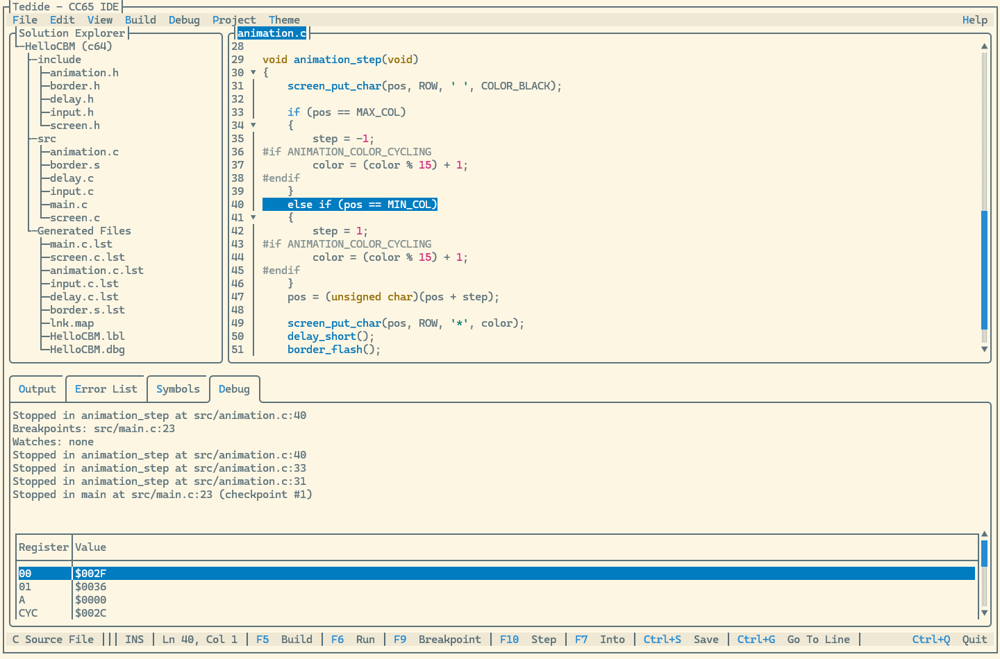

A terminal (TUI) IDE for [cc65](https://cc65.github.io/) development, modeled loosely
on Visual Studio: a resizable solution explorer, a tabbed source editor with 6502/ca65
syntax highlighting, a build output pane (with a separate Error List and a symbol browser) and a
menu/status bar, all driven by `cl65` - plus project/optimizer/compiler/linker settings, Find in
Files, a VICE emulator launcher, source-level debugging against VICE's own binary monitor
protocol, and a Recent Projects and Solutions list. A companion app, **Tedide.DocViewer**, browses
cc65's own manuals offline with a category tree, full-text search and bookmarks - see "Running the
Doc Viewer" below.

## Features

- **Solutions and projects** - `.tsln`/`.tproj` files, New Project scaffolding for every Commodore
  target, multi-project solutions with library projects, project references and a startup project.
- **Solution Explorer** - a folder tree of each project's sources, headers and linker configs, a
  Generated Files node, and New/Rename/Delete File from its right-click menu.
- **Tabbed editor** - syntax highlighting for C, 6502/ca65 assembly, listings, linker maps, VICE
  label files and linker configs; per-tab undo history; open tabs remembered per project.
- **Code navigation** - Go To Definition, Find All References and Rename Symbol across C and
  assembly, Navigate Backward/Forward, Find/Replace, Find in Files and Go To Line.
- **Building** - per-file `cl65` builds with live output, an Error List, Build/Clean Solution,
  Cancel Build, and pre- and post-build commands.
- **Project Settings** - target, optimization, compiler and linker options, include paths and
  defines, SuperCPU support, build events and references, all in one dialog.
- **opt6502** - a built-in optimizer for cc65's generated assembly, favouring size or speed.
- **Running in VICE** - launches the emulator matching the target, with the right memory setup for
  the VIC-20, C16 and Plus/4.
- **Source-level debugging** - over VICE's binary monitor: breakpoints (with conditions), stepping
  by C line, registers, watches, locals, a call stack, and Memory and Disassembly tabs.
- **Symbols** - a filterable browser for the linker map and label file.
- **Git** - status markers in the Solution Explorer, the branch and the caret line's blame, a full
  Blame view, a Git tab to stage, unstage, discard and commit, Compare with Last Commit for any file, and
  change bars in the editor's gutter (added, modified, removed) that follow unsaved edits.
- **Help** - F1 context help opens the bundled **Doc Viewer** at the word under the caret: the cc65
  manuals, The C Book, C64-Wiki, Wikipedia and the VICE manual, with full-text search and bookmarks.
- **Themes** - nine true-colour themes, shared with the Doc Viewer, including Borland Turbo C,
  Commodore 64 and Amber Phosphor.
- **Samples** - nine sample projects, from a bouncing-characters demo to a C128 text editor.

## Contents

- [Features](#features)
- [Prerequisites](#prerequisites)
- [Solution layout](#solution-layout)
- [Running](#running)
- [Debugging](#debugging)
- [Running the Doc Viewer](#running-the-doc-viewer)
- [Publishing a standalone executable](#publishing-a-standalone-executable)
- [Project files](#project-files)
- [Project Settings dialog](#project-settings-dialog)
- [Editing](#editing)
- [Themes](#themes)
- [Status](#status)

## Prerequisites

- .NET SDK 10.0+
- The [cc65](https://cc65.github.io/) toolchain, with `cl65` on your `PATH`
- (Optional) [VICE](https://vice-emu.sourceforge.io) - needed for **Build > Run Project** (launches
  a project's built output in the matching Commodore emulator) and for **Debugging** (launches it
  with its binary monitor enabled instead - see "Debugging" below). Tedide looks for its
  executables at `C:\GTK3VICE-3.9-win64\bin` by default (see `ViceEmulator` in `Tedide.Build`) -
  configurable via **Project > Settings > VICE**, alongside `CC65_HOME` under its own **CC65** tab
  (both are per-machine toolchain settings, not project state, so they're saved once and apply to
  every project). Everything else, including Build Project and Clean Project, works fine without it.

## Solution layout

```text
Tedide.slnx
src/
  Tedide.Core/         Project & solution file model (.tproj / .tsln), cc65 target/optimization metadata,
                       plus parsers for cc65's generated output: LinkerMapFile (lnk.map), LabelsFile (.lbl)
                       and Debugging/DbgFile (.dbg - source-line <-> address resolution for the debugger);
                       Navigation/ is the C/ca65 symbol scanner behind Go To Definition/Find All References
  Tedide.Build/        Drives cl65 as an external process, parses its output into diagnostics, launches VICE
                       (optionally with its binary monitor enabled - see Tedide.Debug); Opt6502/ is the
                       optional optimizer for cc65's generated assembly - see its README.md
  Tedide.Debug/        A client for VICE's binary monitor protocol (breakpoints, registers, memory, stepping)
                       - what Tedide.App's Debug menu talks to once VICE is launched with -binarymonitor
  Tedide.Git/          Runs the git command line and parses its output (status, blame, diff, stage, commit) -
                       what the Solution Explorer's markers and the Git tab use
  Tedide.Theming/      The nine color themes/scheme switching shared by Tedide.App and Tedide.DocViewer
  Tedide.App/          The Terminal.Gui TUI shell (menu bar, solution explorer, editor, output/error
                       list/symbols/debug panes, dialogs)
  Tedide.DocViewer/    A standalone cc65 manual browser - category tree, full-text search, bookmarks
tests/
  Tedide.Core.Tests/   Includes Fixtures/ - real lnk.map/.lbl/.dbg captured from a build, used by
                       LinkerMapFile/LabelsFile/DbgFile's own tests rather than hand-written fixtures
  Tedide.Build.Tests/
  Tedide.Debug.Tests/  Protocol-level tests (byte-exact request/response encoding) plus a fake TCP
                       server standing in for VICE, for ViceMonitorClient's request/response correlation
  Tedide.Git.Tests/    Parser tests on fixture output, plus tests against real git in temporary repositories
tools/
  Cc65DocsDbBuilder/   One-off converter: cc65's HTML manuals -> Docs.db (Markdown + FTS5 search index),
                       embedded in Tedide.DocViewer - see "Running the Doc Viewer" below
  Opt6502Cli/          Command-line front end to the optimizer (opt6502.exe), plus its behaviour tests
                       in cc65's simulator (run_sim65_tests.sh) - see src/Tedide.Build/Opt6502/README.md
samples/
  HelloCBM/            A small multi-file sample solution/project, buildable for every Commodore cc65 target
    HelloCBM.tsln
    HelloCBM.tproj     src/*.c plus one hand-written src/border.s, -I include for the headers
    src/               main.c, screen.c, animation.c, input.c, delay.c, border.s (ca65 assembly)
                       (object files and listings build into the project's obj/ folder - gitignored)
    include/           screen.h, animation.h, input.h, delay.h, border.h
    lib/               Empty - drop a prebuilt .lib archive here to link against it
    bin/               Build output (HelloCBM.prg) - gitignored
  HelloPlus4/          A Plus/4-only sample touring TED chip features the C64's VIC-II/SID don't have
    HelloPlus4.tsln
    HelloPlus4.tproj   src/*.c, -I include for the headers - Target is Plus4, not cross-target
    src/               main.c, screen.c, palette.c, sound.c, speed.c, input.c, delay.c
                       (object files and listings build into the project's obj/ folder - gitignored)
    include/           screen.h, palette.h, sound.h, speed.h, input.h, delay.h
    lib/               Empty - drop a prebuilt .lib archive here to link against it
    bin/               Build output (HelloPlus4.prg) - gitignored
  C128_80/             A C128-only sample touring the VDC chip's 80-column text mode
    C128_80.tsln
    C128_80.tproj      src/*.c, -I include for the headers - Target is C128, not cross-target
    src/               main.c, screen.c, ruler.c, columns.c, contrast.c, input.c
                       (object files and listings build into the project's obj/ folder - gitignored)
    include/           screen.h, ruler.h, columns.h, contrast.h, input.h
    lib/               Empty - drop a prebuilt .lib archive here to link against it
    bin/               Build output (C128_80.prg) - gitignored
  Plus4colours/        A single-file demo of the Plus/4 TED chip's full 121-colour palette
    Plus4colours.tsln
    Plus4colours.tproj   src/main.c, -I include for the headers - Target is Plus4
    src/                 main.c
    include/             main.h
    lib/                 Empty - drop a prebuilt .lib archive here to link against it
    bin/                 Build output (Plus4colours.prg) - gitignored
  bounce/              A single-file demo bouncing characters around the screen
    bounce.tsln
    bounce.tproj         src/bounce.c, -I include for the headers - Target is C64
    src/                 bounce.c
    include/             main.h
    lib/                 Empty - drop a prebuilt .lib archive here to link against it
    bin/                 Build output (bounce.prg) - gitignored
  c16colours/          A single-file demo of the Commodore 16's full 16-colour palette
    c16colours.tsln
    c16colours.tproj     src/main.c, -I include for the headers - Target is C16
    src/                 main.c
    include/             main.h
    lib/                 Empty - drop a prebuilt .lib archive here to link against it
    bin/                 Build output (c16colours.prg) - gitignored
  inflate/             A single-file demo of a sprite that grows and shrinks in an off-screen buffer
    inflate.tsln
    inflate.tproj        src/inflate.c, -I include for the headers
    src/                 inflate.c
    include/             screen.h
    lib/                 Empty - drop a prebuilt .lib archive here to link against it
    bin/                 Build output (inflate.prg) - gitignored
  Nano128/             A nano-style full-screen text editor for the C128, in 80-column (VDC) mode
    Nano128.tsln
    Nano128.tproj        src/*.c, -I include for the headers - Target is C128, not cross-target
    src/                 main.c, screen.c, buffer.c, fileio.c, input.c, editor.c, vblank.c
                         (object files and listings build into the project's obj/ folder - gitignored)
    include/             screen.h, buffer.h, fileio.h, input.h, editor.h, vblank.h
    lib/                 Empty - drop a prebuilt .lib archive here to link against it
    bin/                 Build output (Nano128.prg) - gitignored
  CBMInfo/             A single-screen system/hardware info utility, cross-target like HelloCBM
    CBMInfo.tsln
    CBMInfo.tproj        src/*.c, -I include for the headers
    src/                 main.c (orchestrates the modules below into one SystemInfo struct/screen),
                         machine.c, cpu.c, memory.c, video.c, sound.c - one module per category of
                         detail, each with its own detection logic (see "Running" below)
    include/             main.h, machine.h, cpu.h, memory.h, video.h, sound.h
    lib/                 Empty - drop a prebuilt .lib archive here to link against it
    bin/                 Build output (CBMInfo.prg) - gitignored
```

## Running

```bash
dotnet run --project src/Tedide.App
```

From the **File** menu:

- **New Project...** to scaffold a fresh cc65 project (name, target platform, destination folder)
  using the same `src`/`include`/`lib`/`bin` layout as the bundled samples (see "Project files"
  below) - a starter `src/main.c` that `#include "main.h"`s a starter `include/main.h` (rather than
  `#include <conio.h>`/`<stdio.h>` directly), so the include/ folder and its `-I include` are
  exercised by a real, working include from the start, not just present but unused. `lib/` starts
  empty - drop a prebuilt cc65 `.lib` archive in it and it's linked in automatically, no `.tproj`
  change needed (every `.lib` file found there is passed to `ld65` after the compiled object
  files). `OutputFile` points at `bin/<Name><target extension>`.

  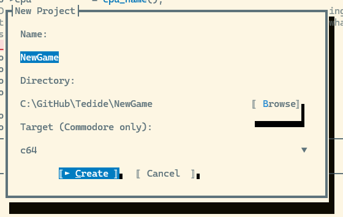
- **Open Project...** and pick `samples/HelloCBM/HelloCBM.tsln` (or `samples/HelloCBM/HelloCBM.tproj`) for a
  working example - it's deliberately split across several `.c`/`.h`/`.s` files (see layout above) to
  show off the Solution Explorer's folder tree and the editor's tabs (see "Editing" below), and its `border.s`/`animation.c` use per-target conditional
  compilation so the same sample builds correctly on every Commodore machine cc65 targets, not just
  the C64.
- **Open Project...** and pick `samples/HelloPlus4/HelloPlus4.tsln` for the opposite story - a Plus/4-only tour
  of TED-chip features the C64's VIC-II/SID can't do: `palette.c` cycles the border/background
  through TED's full 121-color palette (16 hues x 8 luminance levels, not the C64's fixed 16
  colors), `sound.c` pokes TED's sound registers directly for a voice-1 arpeggio and a burst from
  voice 2's dedicated noise generator, and `speed.c` benchmarks `fast()`/`slow()`, the C16/Plus4's
  CPU clock-doubling switch that the C64/128 doesn't have.
- **Open Project...** and pick `samples/C128_80/C128_80.tsln` for a tour of the C128's VDC-chip 80-column
  text mode, a feature none of cc65's other Commodore targets have (they're all fixed at 40 columns
  or fewer): `ruler.c` reports the real screen width via `screensize()` and draws a column-number
  ruler spanning every column to prove it, `columns.c` lays out two independent text columns 40
  characters apart that would collide in 40-column mode, and `contrast.c` switches live to
  40-column mode and back with `videomode()`, drawing the same ruler both times so the difference
  is visible side by side.
- **Open Project...** and pick `samples/Plus4colours/Plus4colours.tsln` for a single-file demo of
  the Plus/4's full TED palette - a grid of all 128 hue/luminance combinations (8 hues x 16
  luminance levels) drawn directly into screen/colour RAM, with row (luminance) and column (hue)
  labels.
- **Open Project...** and pick `samples/bounce/bounce.tsln` for a single-file demo bouncing five
  characters (`@`, `A`, `B`, `C`, `D`) diagonally around the screen, each reflecting off whichever
  edge it hits.
- **Open Project...** and pick `samples/c16colours/c16colours.tsln` for a single-file demo of the
  Commodore 16's full 16-colour palette, drawn as a labelled strip of colour blocks (0-F).
- **Open Project...** and pick `samples/inflate/inflate.tsln` for a single-file demo of a
  character-fill sprite that grows and shrinks between zero and the full screen size, redrawn each
  frame from an off-screen buffer.
- **Open Project...** and pick `samples/CBMInfo/CBMInfo.tsln` for a single-screen system/hardware
  info utility, buildable for all eight non-GEOS Commodore targets Tedide offers - `main.c` itself
  is just a thin orchestrator that calls into five small modules, each owning one category of
  detail and calling out to a real cc65 runtime API wherever one exists, rather than assuming
  compile-time constants for everything the way the original single-file version did:
  - `machine.c` names the physical machine - refined with `get_ostype()` (c64.h) into the exact
    ROM/hardware variant actually detected (e.g. an SX-64) on the one target that exposes it.
  - `cpu.c` confirms the CPU family with `getcpu()` (6502.h, works on every target) before naming
    the specific chip (6510/8502/6502/7501/8501/6509 all report identically as CPU_6502, since
    they're opcode-compatible - `getcpu()` only rules out the unexpected). It also probes for (and
    switches on) any CPU-speed accelerator this machine actually has via cc65's `accelerator.h` -
    the C128's own built-in 1/2 MHz native switch, or an add-on C64 cartridge (SuperCPU, Turbo
    Master, a C65/C64DX in C64 mode, Chameleon, C64DTV, checked in that order) - printing
    "SuperCPU Enabled: YES/NO" specifically (this is what turning on Tedide's own "Enable SuperCPU
    support" project setting actually launches into - see "Project Settings dialog" below),
    "Supports Fast Mode: YES/NO" plus which one was found for any of the five, and folding the
    result straight into the reported clock speed wherever accelerator.h documents an exact rate for
    it (20 MHz/4 MHz/3.5 MHz/2 MHz respectively; Chameleon's and the C64DTV's own "fastest" tiers
    have no such documented figure, so those two enable fast mode but leave the reported speed at
    its normal nominal value rather than inventing a number).
  - `memory.c` reports free heap right now via `_heapmemavail()` (stdlib.h), alongside the fixed
    total RAM installed.
  - `video.c` detects PAL vs. NTSC *live* by polling the video chip's own raster line counter to
    find its wraparound point (262 lines for NTSC, 312 for PAL) - properly scoped to the VIC-II/TED
    targets that actually have such a register (a bug in the original version ran this
    unconditionally on every target, including ones with no such chip at all), and reads back the
    *actual* current text screen size via `screensize()` (conio.h) rather than a fixed guess, so it
    reflects e.g. the C128's 40/80-column switch correctly.
  - `sound.c` names each machine's sound hardware and voice count, confirmed directly against
    cc65's own `_sid.h`/`_ted.h`/`_vic.h` register-layout headers.

  Where cc65 genuinely has no runtime API for something (e.g. total installed RAM, or which exact
  6502 variant a machine has), the value is still a per-target constant - each module's own header
  comment says which of its own values are truly dynamic versus necessarily fixed at compile time,
  since cc65 builds a separate binary per target rather than one binary that runs everywhere.
- **Open Project...** and pick `samples/Nano128/Nano128.tsln` for the largest sample - Nano128, a
  nano-style full-screen text editor for the C128, running in the VDC chip's 80-column mode from
  "C128_80" above. Commodore keyboards don't have most of the Ctrl+letter combos nano uses on a PC
  keyboard, so the eight function keys stand in for its Ctrl-shortcuts instead (F2 Save, F3/F4
  Search, F5/F6 Cut/Uncut Line, F7/F8 Page Up/Down, Home for start-of-line, Stop to open a
  different file) - except Exit, which really is Ctrl+X: Commodore's Ctrl masks a key to its low 5
  bits the same way a real terminal's does, and that happens to match nano's own binding exactly.
  Typed text is genuinely mixed-case (switching to the C128's lower/upper PETSCII character set, so
  Shift+letter capitalizes rather than producing a graphics symbol), and the title bar shows free
  heap RAM live, since `buffer.c` grows/shrinks each line's allocation as you type rather than
  reserving a worst-case block per line.
- **Recent Projects and Solutions** lists the 10 most-recently-opened `.tproj`/`.tsln` paths
  (persisted per-user, independent of any one project), numbered for Alt+1..9 accelerators like
  Visual Studio's own list. Selecting a stale entry (moved/deleted on disk) drops it from the list
  with an error instead of crashing.

  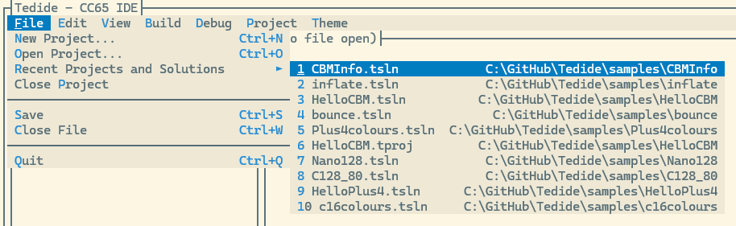
- **Close Project** clears the currently loaded project(s) from the session (closing the open file
  first, prompting to save if modified) without touching anything on disk.

The Solution Explorer recurses through a project's directory tree, showing every `.c`/`.h`/`.s`/
`.asm`/`.inc`/`.cfg` file (not just the ones listed in `SourceFiles`, which is what's actually
passed to `cl65`) organized into the same folders they live in on disk - so `src/`, `include/`,
etc. show up as proper subfolders, and headers/linker config files show up for browsing/editing
even though they're never compiled directly. Build-output folders (`bin/`, `obj/`, `.git/`, `.vs/`)
are hidden from the tree, but a project that's actually been built gets its own **Generated Files**
node listing whichever of these exist and are enabled (see "Project Settings dialog" below): each
source file's own `.lst` (assembler listing, under `obj/`), `lnk.map` (linker map), `{Name}.lbl` (VICE label
file) and `{Name}.dbg` (debug info). Right-click (or Shift+F10) a folder/file node for **New
File...**/**Rename File**/**Delete File** -
not offered on the project root itself, only inside one of its subfolders. **New File...** defaults
the new file's name to `newfile.h` in an `include` folder or `newfile.c` anywhere else (matching
whichever folder - or the folder of whichever file - was right-clicked). A newly created header
(any `.h` file, not just ones named `newfile.h`) starts pre-filled with the standard
`#ifndef`/`#define`/`#endif` include guard, named after the file itself (e.g. `screen.h` ->
`SCREEN_H`) - the same convention every bundled sample's own headers already follow. **Rename File** renames
in place (same folder) and keeps a project's `SourceFiles` in sync with the new path - removed if
the new name's extension isn't one cl65 compiles, added under the new path if it is, so renaming
e.g. `main.c` to `main.h` (or vice versa) is tracked correctly too, not just a same-extension
rename. The border between the Solution Explorer and the editor is a draggable splitter - drag it
to resize both panes.

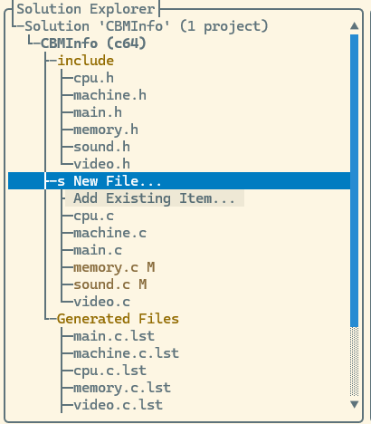

### Solutions with several projects

A solution can hold any number of projects. Right-click the solution, the root of the Solution
Explorer, for **Add New Project...**, **Add Existing Project...**, **Build Solution** and **Clean
Solution**. Right-click a project for **Set as Startup Project**, **Build**, **Clean**,
**Settings...**, **Remove from Solution**, which leaves its files on disk, and **Delete
Project...**, which also sends the project's folder to the Recycle Bin after asking. A project
whose folder also holds the solution file or another project can't be deleted, since its folder
would take them too. Add New Project starts beside the existing projects, never inside one.

- **The startup project**, shown in bold, is the one F5 builds, F6 runs and Start Debugging
  debugs; its breakpoints and symbols are the ones shown. It's saved in the `.tsln`. Without one,
  it's the first application project.
- **Library projects.** A project's output type is Application or Library. A library's object
  files are archived by `ar65` into a `.lib` instead of being linked.
- **References.** A project can reference library projects in the same solution, on the
  **References** tab of Project Settings. Each library builds first, its include paths are added to
  the project's own, and its `.lib` is linked in, each library before the ones it uses. References
  can't form a cycle, and the References tab only offers libraries that wouldn't make one.
- **Building.** Build Project builds the startup project and the libraries it needs; Build Solution
  builds every project. Each library builds before anything that uses it. If a library fails, the
  projects that use it are skipped rather than linked against an old `.lib`, and the rest still
  build. The Error List adds a **Project** column.
- **Debugging into a library.** A library's sources are compiled by full path, so the debug info of
  the program that links it finds them.

### Git

When a project lives in a git repository, Tedide shows its state and can commit, using the `git`
command line you already have, so your own config, hooks and line-ending rules apply. Without git,
or outside a repository, none of this appears.

- **The Solution Explorer** marks each changed file with git's letter and a colour: `M` modified
  (amber), `?` new and untracked or `A` added (green), `!` conflicted (red).
- **The tab row** above the editor shows the branch, how far it is ahead of or behind its upstream
  (`main ↑2 ↓1`), and who last changed the caret's line: `Ln 12: aross, 3 days ago: Add tabs`. An
  edited line reads "Not committed yet", since the editor's own text is what gets blamed.
- **The Git tab** lists Changes and Staged files. In either list, Space stages or unstages the
  selected file, Enter opens it, and Delete (Changes only) discards its changes after asking. A new
  file is deleted instead, and an open tab is reloaded or closed to match. Commit Staged commits
  what's staged; Commit All stages everything first, new files included, as Visual Studio does.
  Open files with unsaved edits are saved before anything is staged or committed.
- It refreshes after saves, builds and file operations, and every few seconds, so commits made in
  another terminal show up too.

Fetch, pull and push aren't offered; use git itself for those.

Press **F5** (or **Build > Build Project**) to invoke `cl65` - once per source file (`-c`, compile
and assemble but don't link) so each gets its own assembler listing, then once more to link the
resulting object files into the output binary; output from every invocation streams live into the
**Output** tab as one build, and its success/failure (with an error count) is reported when it
finishes; a successful build additionally reports the output binary's size in bytes. Every
diagnostic `cl65`/`ca65`/`ld65` reported is also parsed into the **Error List** tab (severity/file/
line/message columns); activating a row jumps straight to that line, the file opened if it isn't
already. A source file that fails to compile doesn't stop the rest from being compiled too - only
the link step is skipped, so a single build surfaces every file's errors at once. **Build > Cancel
Build** stops a running build, killing `cl65` and every compiler/assembler process it started (only
one build runs at a time - pressing F5 again mid-build says so rather than starting a second). **Build > Clean
Project** deletes the project's build artifacts (each source file's object file and assembler
listing, linker map, label file, debug info file, and the linked output binary) without
rebuilding. **F6** (or **Build > Run Project**) builds first, then launches the built output in
the VICE emulator matching the project's target, auto-starting it. For a VIC-20 project, this also
passes xvic's own `-memory` flag matching whichever linker config is actually in effect - cc65's
default `vic20.cfg` (or no custom config at all) launches an unexpanded VIC-20 (`-memory none`),
while one of cc65's own RAM-expanded configs (e.g. `vic20-32k.cfg`, browseable from the Linker tab -
see "Project Settings dialog" below) launches VICE with the matching expansion instead
(`ViceEmulator.Vic20MemorySpecFor` maps cc65's own config names by file name; an unrecognized custom
config is treated the same as no config at all - an unexpanded VIC-20). A C16 or Plus/4 project gets
the same treatment via xplus4's own `-ramsize <16/32/64>` option instead
(`ViceEmulator.Plus4RamSizeFor`): cc65's default `c16.cfg` (or no custom config) assumes an
unexpanded 16K C16, `c16-32k.cfg` assumes its 32K expansion, and `plus4.cfg` assumes the Plus/4's
stock 64K outright (it has no smaller "unexpanded" config the way the C16 does, so that's the
fallback for it even with no custom config set). Every one of these is passed explicitly on every
launch, rather than relying on whatever VICE's own persisted settings last had configured, since
that has nothing to do with which project is actually running.

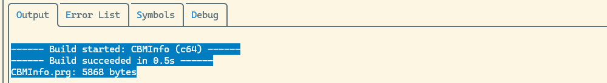

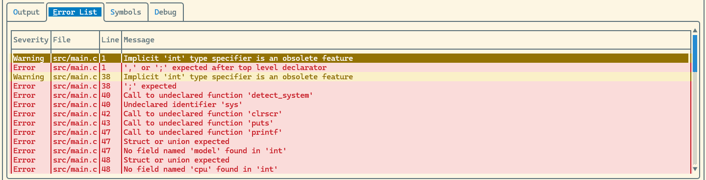

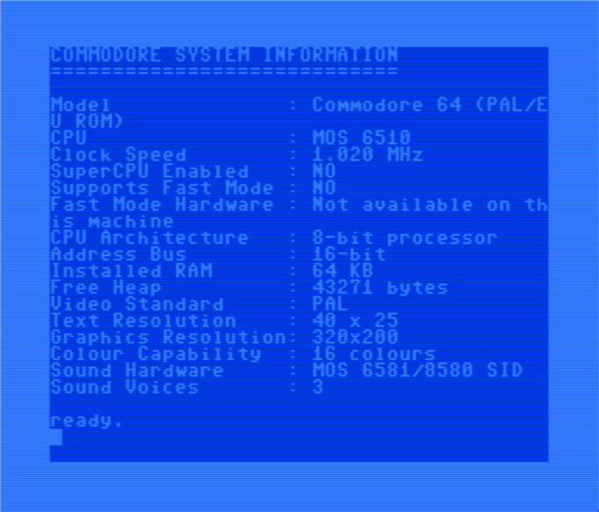

Two more tabs sit alongside Output/Error List: **Symbols** parses the project's `lnk.map`/`.lbl`
(if "Generate linker map file"/"Export labels" are on - see "Project Settings dialog" below) into a
filterable table of every module/segment/export/import/label, without disturbing the plain-text
editing of those files themselves - activating a row opens the underlying file and jumps to the
matching line. **Debug** shows the active debugging session's registers and status - see
"Debugging" below.

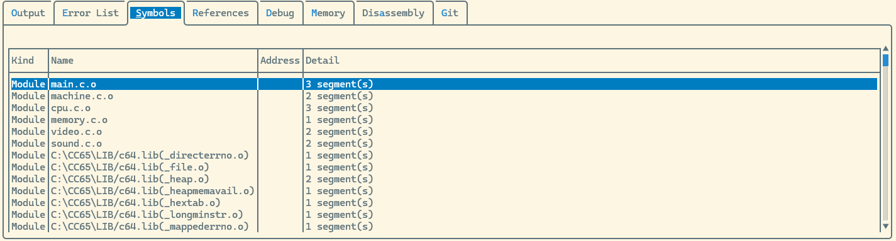

**Edit > Find in Files...** (Alt+Shift+F - not Ctrl+Shift+F, which Windows Terminal keeps for its own Find bar) searches every source/header/assembly file across the
loaded project(s) for a case-insensitive substring and lists every matching line; activating a
result opens that file and jumps the caret straight to the match. The editor's own right-click
context menu (alongside the library's default Undo/Redo/Cut/Copy/Paste/Select All) has Find,
Replace and Find in Files appended to it - Find/Replace open the same Find/Replace dialog as the
Edit menu's own (`Editor.InvokeCommand(Command.Find/Replace)`, exactly what that menu does), and
Find in Files pre-populates the search field with the current selection - just its first line, if
the selection spans more than one - and runs the search immediately, rather than opening to a
blank field.

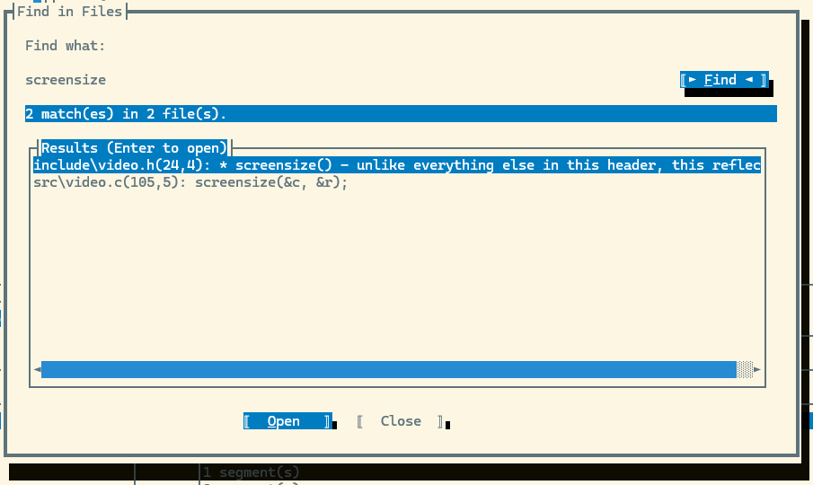

**Edit > Go To Line...** (Ctrl+G) prompts for a line number (pre-filled with the caret's current
line, validated against the open document's actual line count) and jumps straight there.

**Edit > Go To Definition** (F12) jumps to where the symbol under the caret is defined, and
**Edit > Find All References** (Shift+F12) lists every use of it in the **References** tab, with
the definition rows highlighted. Both are also on the editor's right-click menu. They understand
C and ca65 rather than matching text (see `Tedide.Core/Navigation`):

- They skip comments and strings. They know C functions, prototypes, variables, `#define`s,
  typedefs, struct/union/enum tags, members and enum constants, and ca65 labels, constants,
  `.proc`, `.macro`, `.struct`/`.enum` and `.import`s.
- Parameters, locals and cheap `@local` labels are scoped, so a local `width` never leads to, or
  counts as a use of, a global `width`.
- cc65 gives C names a leading underscore in assembly. A call to `border_flash()` in C therefore
  leads to `_border_flash` in a `.s` file, and Find All References lists both.
- Pressing F12 on a function's definition goes to its prototype, and on an `#include` or
  `.include` line it opens that file.
- If the project doesn't define a symbol, cc65's own headers are searched, starting with the
  headers the file actually includes. `#if defined(__C64__)`-style branches are evaluated with
  the project's target macros and `-D` defines. So `COLOR_BLACK` in a C64 project opens `c64.h`,
  not the other twenty target headers that also define it.
- When there's still more than one candidate, a picker lists them.

**Edit > Rename Symbol...** (F2, also on the right-click menu) renames the symbol under the caret
everywhere Find All References finds it, including the assembly side of a C name with its
underscore. Comments and strings are left as they are.

- It refuses invalid names, C keywords, and names already in use, including a local that would
  capture a renamed global. It also refuses symbols the project doesn't define, such as cc65
  library functions, and a struct or union member whose name more than one struct declares: which
  struct `s->x` belongs to isn't worked out yet, so renaming one `x` would rename them all. Those two
  are refused as soon as you press F2, before a new name is asked for.
- In the open file, the rename is a single editor change that Undo reverts, and the file stays
  unsaved.
- Every other file is rewritten on disk straight away, in its own encoding. All the new text is
  worked out before anything is written, so a file that's changed underneath stops the rename
  before any file is touched.

**Edit > Navigate Backward** (Alt+Left) returns to where the caret was before the last jump, and
**Edit > Navigate Forward** (Alt+Right) undoes that, as in Visual Studio. Go To Definition, the
References and Error List tabs, Find in Files, Go To Line and the Symbols tab all count as jumps;
ordinary caret moves and typing don't. Visual Studio's own Ctrl+- isn't used, because Windows
Terminal takes it for its font size.

**Help > Context Help** (F1) opens the Doc Viewer at the word under the caret: the section whose
heading names it, such as `cputsxy` in the cc65 function reference or `.BYTE` in the ca65 manual,
or a search for the word when no heading does. Inside Windows Terminal the Doc Viewer opens as a
new tab in the same window; elsewhere it gets a console window of its own. Tedide looks for
`Tedide.DocViewer.exe` beside itself, then in a `publish-docviewer` folder next to its own folder
(the layout the publish tasks produce), then in the repository's own Doc Viewer build output. Set
`TEDIDE_DOCVIEWER` to the exe's full path to use one somewhere else.

Press **Ctrl+W** (or **File > Close File**) to close the file being shown. If it has unsaved
changes you're prompted to save, discard, or cancel first (see "Editing" below).

## Debugging

Source-level debugging against a real running C64/128/Plus4/etc. via VICE's own **binary monitor
protocol** (`Tedide.Debug`'s `ViceMonitorClient`) - breakpoints, registers, and stepping by source
line, not just launching the emulator and watching it run.

1. Turn on **"Generate debug info"** on Project Settings' Linker tab (`-g`, plus `--dbgfile`
   forwarded through cl65 as `-Wl --dbgfile,path` since cl65 has no top-level flag for it) - without
   this there's no `.dbg` file to resolve breakpoints/addresses against source lines.

   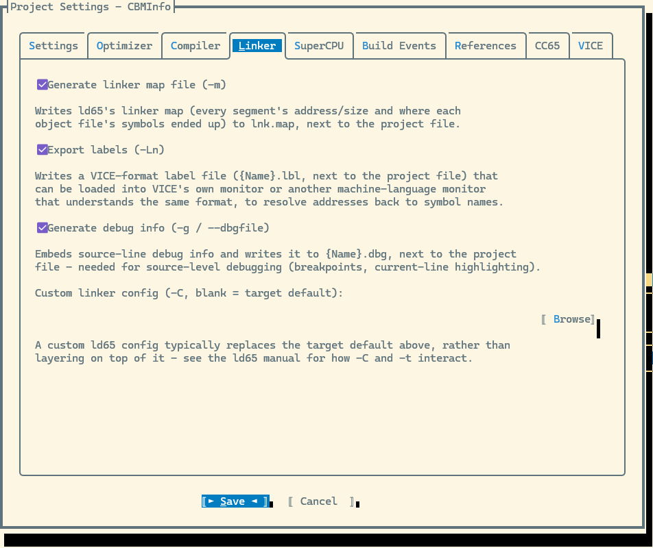
2. Set a breakpoint with **F9** (or **Debug > Toggle Breakpoint**) on the line the cursor's on. This
   is the only way to set one - Terminal.Gui.Editor's `Editor` has no clickable gutter to click a
   margin instead. Every enabled breakpoint's line is highlighted in the editor (a persistent red
   background) the moment it's set, not just while a debug session is stopped there. Breakpoints
   persist per-project in `{Name}.breakpoints.json`, next to the `.tproj` file (deliberately not
   part of the `.tproj` itself - see `BreakpointsFile` - toggling one shouldn't dirty the project's
   own build settings). **Debug > Breakpoints...** lists/toggles/deletes them all in one dialog -
   selecting a row jumps the editor straight to that breakpoint's file and line, same as the Error
   List/Symbols tabs.

   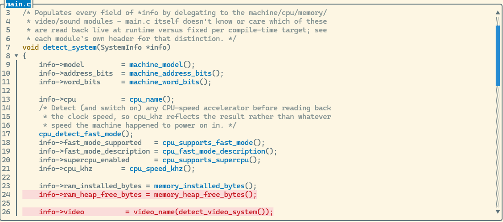

   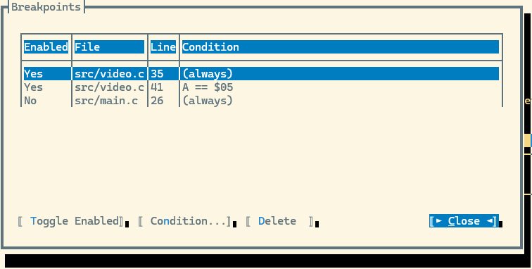
3. **Debug > Start Debugging** (Shift+F5) builds, launches VICE with `-binarymonitor`, connects,
   opens (and centers the editor on) the source line containing `main()`, resolves every enabled
   breakpoint's source line to an address via the `.dbg` file, sets them, and starts running. The
   **Debug** tab is switched to automatically so its status/register panel is visible right away.
   The editor becomes read-only for the whole session - the running binary no longer matches
   whatever you'd type, and this also guarantees jumping between files while stopped never gets
   blocked by an "unsaved changes?" prompt. When a breakpoint is hit, the Debug tab shows the
   register snapshot and status (`Stopped at <file>:<line>`), and the editor jumps to and
   vertically centers the current line (highlighted via a `Terminal.Gui.Editor` line transformer,
   not the gutter - see step 2; the same centering happens for every other stop below, not just the
   first). **Continue** (Ctrl+F5) resumes; **Step Over** (F10) and **Step Into** (F7 - Windows Terminal keeps F11 for full screen) advance by *source line*, not raw 6502
   instruction - it single-steps repeatedly until the resolved location changes to a *different* C
   line (skipping over addresses that only resolve to cl65's own generated assembly, e.g. a
   function's prologue, so it doesn't stop one instruction early), so one Step press is one C
   statement, not one machine instruction. Step Into only stops in code that's part of the project:
   a call into cc65's own runtime library (e.g. `printf`, or the helpers the compiler calls for
   things like pushing arguments) is run straight through to its return, since there's no source
   to show for it. **Stop Debugging** disconnects (leaving VICE itself running) and makes the editor
   editable again.

   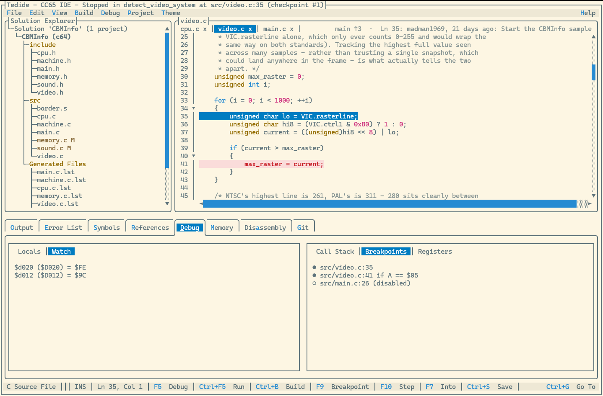
4. The **Debug** tab itself shows, beyond the register table: the register values with the 6502
   status register (`FL`) decoded into its individual flags (`N V - B D I Z C`, set flags shown as
   their letter and clear ones as `.`, alongside the raw hex byte); the status line's enclosing
   function name when it resolves (`Stopped in detect_system at main.c:116`, from the `.dbg` file's
   own `scope` records) rather than just a line number; a compact strip of every breakpoint in the
   project (not just the current file), each marked `(disabled)` if toggled off; a short "recent
   stops" history (last 20, most recent first) so earlier stops aren't lost the moment a new one
   overwrites the status line; and a **watches** strip - **Debug > Add Watch...** prompts for a
   symbol name (matched against the `.dbg` file's own symbol table, with or without cc65's leading
   underscore) or a raw address (`$d020`, `0xd020`, or decimal), plus whether to read it as a single
   byte or a little-endian word, and shows its live value (`raster ($D012) = $34`) refreshed on every
   stop/step via `ViceMonitorClient.GetMemoryAsync`. Watches aren't persisted - a rebuild can shift
   where a symbol resolves to, so **Debug > Clear Watches** (or simply stopping the session) drops
   them rather than risk showing a stale address.

   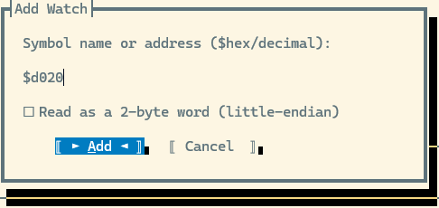
5. Beside the registers, a **Locals** table lists the parameters and local variables of the C
   function execution stopped in, with each one's type and value (`i : unsigned int = 1 ($0001)`),
   refreshed on every stop. cc65 keeps C locals on a software stack and its debug info records only
   each variable's offset in the function's stack frame - no types, and nothing about how far the
   stack has moved by a given line - so Tedide works out where each one is from the assembly cl65
   generates for the file (`obj/src/*.c.s`, following every push and pop), and reads its type from
   its declaration in the C source. Pointers show as an address, numbers in decimal with the hex
   alongside, and `char`s with their character. A variable whose declaration hasn't run yet shows
   as "not yet on the stack". Variables declared inside an inner block (a loop body's own locals,
   say) aren't shown - cc65 leaves them out of its debug info.

   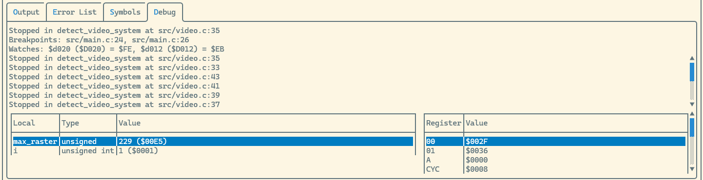
6. A **call stack** sits beside the recent stops, innermost first, for example
   `border_flash  src/border.s:46` ← `animation_step  src/animation.c:51` ← `main  src/main.c:23`.
   Press Enter on a frame to open its source line.
   - cc65 keeps no frame records, so Tedide rebuilds the stack from the 6502's hardware stack. Any
     pushed address that points just past a `JSR` in the program's code counts as a return address.
   - Frames inside cc65's runtime show the nearest label instead (`pushax+3`).
   - This is the same heuristic a machine-code monitor's backtrace uses, so data that happens to
     look like a return address can occasionally add a frame.
7. **Conditional breakpoints:** **Debug > Breakpoint Condition...** sets a condition on the breakpoint
   at the caret, creating the breakpoint if needed. The **Condition...** button in the Breakpoints
   dialog does the same for the selected one.
   - VICE evaluates the condition, so it uses VICE's monitor syntax, e.g. `A == $05`, `X != $00`, or
     `@cpu:$d020 == $0e` for memory. Those were checked against VICE 3.9.
   - If VICE rejects a condition when the session starts, the Output panel says so and that
     breakpoint is left off for the session, rather than stopping every time.
   - Conditions are saved with the breakpoints.
8. The **Memory** tab shows 256 bytes as hex and text from an address you type: a symbol, `$hex` or
   decimal, the same as Add Watch.
   - **-$100** and **+$100** page through memory.
   - It refreshes at every stop, with bytes that changed since the previous stop highlighted.
   - Reads are side-effect-free peeks, so viewing I/O registers can't disturb the program.
9. The **Disassembly** tab shows the 6502 code around the PC at every stop, with the current
   instruction marked.
   - Each row shows the address, bytes, instruction and cycle count (`*` = +1 on a page crossing,
     `**` = branch timing), plus a note: the label at that address, the label its operand refers to
     (`jsr $0C0F  -> pusha`), and the source line where a new one starts.
   - It decodes for the project's CPU, including the 65C02 instructions for a SuperCPU project.
   - Enter on a row opens its source line.

   VICE's monitor only exposes the raster position (`LIN`/`CYC`), not a running cycle count, so these
   per-instruction counts are as close to cycle profiling as Tedide can get from it.

The binary monitor's own protocol details (header layout, command bytes, how a checkpoint hit is
reported, which register names VICE reports for the 6502) were confirmed against a real VICE 3.9
session while building this, not just the manual - see VICE's own manual,
[chapter 13](https://vice-emu.sourceforge.io/vice_13.html), if extending `ViceMonitorClient`
further.

Tedide logs to `%LocalAppData%\Tedide\logs\tedide-<date>.log` (Serilog, one file per day, 14 days
kept) - debug-level detail on the checkpoint/step/resume flow above, and a full stack trace for any
unhandled exception, since a crashed Terminal.Gui app otherwise just vanishes with no on-screen
trace. Worth checking first if the app ever closes unexpectedly.

## Running the Doc Viewer

```bash
dotnet run --project src/Tedide.DocViewer
```

A single window: a category/page tree on the left, and the selected page's rendered Markdown on the
right (via Terminal.Gui's own `Markdown` view). The border between them is a draggable divider,
and its position is remembered between runs, as is which books you've collapsed in the tree. The tree holds five books:

| Book | Contents | Licence |
| --- | --- | --- |
| **cc65 Manual** | every cc65 manual - the tools, the libraries, each target - plus a Plus/4 and C16 memory map (TED registers, TED colours, the Plus/4's ACIA, and the zero-page and system locations cc65 uses), generated from cc65's own headers | cc65's own (zlib) |
| **The C Book** | Banahan, Brady & Doran's complete C tutorial | its own free-redistribution licence |
| **C64-Wiki** | 34 articles: the C64 and its CPU, the VIC-II/SID/CIA chips, the memory map and bank switching, graphics modes, sprites, raster interrupts, the KERNAL, BASIC, opcodes, PETSCII and input; the PET 2001 and IEEE-488; and the C16, 116 and Plus/4, their TED chip, the TEDMON monitor and the 1551 drive | GNU FDL |
| **Wikipedia** | 13 articles on the PET, C16 and Plus/4 and their hardware: the PET, Commodore BASIC, PETSCII, the 6502, the 6520 PIA, 6522 VIA and 6845 CRTC, IEEE-488; the Plus/4, Commodore 16, TED chip, 6510 family (the C16/Plus/4's 7501/8501) and 1551 drive | CC BY-SA 4.0 |
| **VICE Manual** | the chapters on running the emulators, each machine's options (PET included), media images and file formats, the monitor and binary monitor, c1541 and petcat | GNU GPL |

Each third-party book ends with its licence: a page listing each article's source and revision
alongside the licence (C64-Wiki, Wikipedia), or the manual's own Copyright and GPL chapters (VICE).
All of it comes from `Docs.db`, an embedded SQLite database built once ahead of time by
`tools/Cc65DocsDbBuilder` from the sources' own HTML (checked in under its `SourceHtml/`) -
regenerate it (and rebuild) if any of them change.

`Tedide.DocViewer --topic <word>` opens straight at the section whose heading names the word, or
at a search for it. Tedide's F1 uses this (see "Running" above).

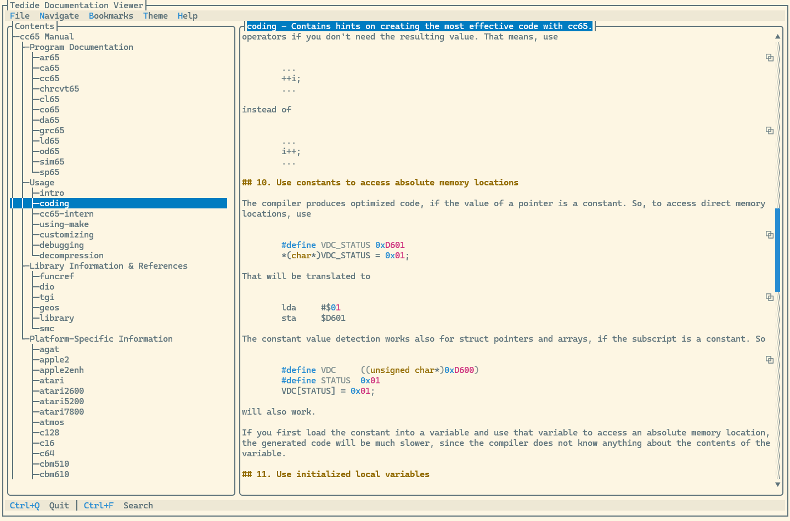

- **Navigate** - **Back**/**Forward** (Alt+Left/Right) walk browser-style history; clicking a
  cross-page link (or pressing Enter on one) does too. A same-page `#slug` link is scrolled to
  directly by the Markdown view itself, without adding a history entry. **Search Documentation...**
  (Ctrl+F) runs a full-text search (Docs.db's FTS5 index) across every page at once.
- The content pane's right-click context menu (alongside the library's default Select All/Copy)
  has **Find...**, modeled on Tedide.App's own Editor Find - searches just the page currently on
  screen rather than every page, jumping to (scrolling toward) the next match and wrapping around
  once it reaches the end.
- **Bookmarks** - **Add/Remove Bookmark for Current Page** (Ctrl+D) toggles a bookmark for
  whatever's open (prompting for a label when adding one); **Saved Bookmarks** lists them all,
  each jumping straight back to its page.
- **Theme** - the same nine runtime-switchable color themes as Tedide.App (see "Themes" below);
  picking one here also changes what Tedide.App opens with next, and vice versa, since both share
  the same per-user `ThemeSettings`.
- **Help > About Tedide DocViewer...** - name, description, credits and a repo link (Tedide.App
  has the same **Help > About Tedide...**, its text adapted for the IDE rather than this viewer).

## Publishing a standalone executable

VS Code tasks build single, self-contained executables that run on a Windows machine with no .NET
runtime installed - **publish Tedide.App (standalone exe)** into `publish/Tedide.App.exe`, and
**publish Tedide.DocViewer (standalone exe)** into `publish-docviewer/Tedide.DocViewer.exe`
(alongside its `Docs.db`, copied there explicitly by a post-publish MSBuild target - see the
comment on `CopyDocsDbToPublishDir` in `Tedide.DocViewer.csproj` for why a plain
`CopyToPublishDirectory` isn't reliable enough for this on its own). **publish all (standalone
exes)** just runs both of those in sequence. Equivalent from the command line:

```bash
dotnet publish src/Tedide.App/Tedide.App.csproj -c Release -r win-x64 --self-contained true -p:PublishSingleFile=true -p:IncludeNativeLibrariesForSelfExtract=true -p:DebugType=none -p:EnableCompressionInSingleFile=true -p:InvariantGlobalization=true -o publish

dotnet publish src/Tedide.DocViewer/Tedide.DocViewer.csproj -c Release -r win-x64 --self-contained true -p:PublishSingleFile=true -p:IncludeNativeLibrariesForSelfExtract=true -p:DebugType=none -p:EnableCompressionInSingleFile=true -p:InvariantGlobalization=true -o publish-docviewer
```

Each result is one ~40MB `.exe` (down from ~86MB without the last two flags: compressing the
self-contained .NET runtime bundled inside a single-file exe, and dropping ICU globalization data
neither app needs since nothing in either does culture-sensitive comparison/formatting) - drop it
anywhere and run it directly. `win-x64` is the only target tested; swap `-r` for another
[RID](https://learn.microsoft.com/dotnet/core/rid-catalog) to publish for a different platform.
Trimming (`-p:PublishTrimmed=true`) would shrink `Tedide.App.exe` further to ~14MB but isn't
enabled - it flags every JSON persistence class (project/solution loading, themes, layout, recent
projects, toolchain settings) as trim-unsafe, since none of them use a source-generated
`JsonSerializerContext`.

## Project files

A `.tproj` file is a small JSON document describing what `cl65` needs to build a project. Here's
an example, laid out the way GitHub's most common C project layout does (`src/`, `include/`,
`bin/`):

```json
{
  "Name": "HelloCBM",
  "Target": "C64",
  "OptimizationLevel": "Standard",
  "GenerateAssemblyListing": true,
  "AddSourceAsComment": true,
  "GenerateLinkerMap": false,
  "GenerateDebugInfo": false,
  "ExportLabels": false,
  "SourceFiles": ["src/main.c", "src/screen.c"],
  "OutputFile": "bin/HelloCBM.prg",
  "LinkerConfigPath": null,
  "IncludePaths": ["include"],
  "PreprocessorDefines": [],
  "ExtraArguments": [],
  "OutputType": "Application",
  "ProjectReferences": []
}
```

| Field | What it controls |
| --- | --- |
| `Target` | Any of the platforms `cl65 -t` supports (`C64`, `Apple2`, `Nes`, `Atari`, ...; see `Cc65Target` in `Tedide.Core`) - the Project Settings dialog's dropdown restricts this to the nine Commodore 8-bit machines cc65 targets (`Cc65TargetExtensions.CommodoreTargets`), since that's Tedide's focus, but any value `cl65` accepts works if set by hand. |
| `OptimizationLevel` | One of cc65's optimizer presets (`None`, `Standard` = `-O`, `Inline` = `-Oi`, `Register` = `-Or`, `InlineKnownFunctions` = `-Os`, `Extended` = `-Ox`, or `Maximum` = `-Oirs`, combining the last three) - see `Cc65OptimizationLevel`. |
| `GenerateAssemblyListing` / `AddSourceAsComment` | Control the assembler listing cl65 can emit for each source file (`-l` / `-T`), under the project's `obj/` folder (e.g. `src/main.c` -> `obj/src/main.c.lst`) - see "Project Settings dialog" below. Both default to `true`. |
| `GenerateLinkerMap` | Whether `ld65` emits a linker map (`-m`) to `lnk.map`, next to the project file - see "Symbols" under "Running" above. Defaults to `false`. |
| `ExportLabels` | Whether `ld65` emits a VICE-format label file (`-Ln`) to `{Name}.lbl`, next to the project file. Defaults to `false`. |
| `GenerateDebugInfo` | Whether cc65/ca65 embed debug info (`-g`) and `ld65` consolidates it into `{Name}.dbg` (`--dbgfile`, forwarded through cl65 as `-Wl --dbgfile,path` - it has no top-level flag for this). Required for the debugger - see "Debugging" above. Defaults to `false`. |
| `EnableSuperCpu` | Whether Build > Run Project/Debug > Start Debugging launch this project in VICE's dedicated SuperCPU emulator (`xscpu64.exe`) instead of the plain C64 one (`x64sc.exe`) - see `ViceEmulator.ExecutableNameFor` - and whether it's compiled and assembled for the SuperCPU's 65816 (`--cpu 65816`, so cc65 can use 65C02 instructions such as `STZ`/`BRA`) rather than the 6502. Only meaningful while `Target` is `C64` (the SuperCPU is a C64-specific accelerator cartridge); ignored for every other target. Defaults to `false`. |
| `UseOpt6502` | Whether each C file's generated assembly is run through opt6502 before it's assembled - see **opt6502** under "Project Settings dialog" below. Defaults to `false`. |
| `Opt6502Mode` | `Size` (the default: opt6502 only removes code) or `Speed` (also inlines cc65 runtime calls inside loops) - passed to opt6502 as `-size`/`-speed`. |
| `OutputFile` | Defaults to `<Name><platform-default-extension>` (e.g. `.prg` for C64, `.nes` for NES) in the project's own directory if not set; Tedide creates the output directory automatically if it doesn't exist yet (`ld65` itself won't). |
| `LinkerConfigPath` | A custom `ld65` linker config file (`-C`), relative to the project directory. `null`/blank uses cl65's built-in per-target default - a custom config typically *replaces* that default rather than layering on top of it. |
| `IncludePaths` | Directories passed to `cl65` as `-I <dir>` (compile-time only), each relative to the project directory - the first-class alternative to putting `-I` in `ExtraArguments`. |
| `PreprocessorDefines` | Preprocessor defines passed as `-D <value>` (compile-time only), each either `"NAME"` or `"NAME=VALUE"`. |
| (CPU) | Not a field - every compile and assemble passes `--cpu` explicitly, from a hand-checked per-target table (`Cc65TargetExtensions.Cc65Cpu`): `6502` for every Commodore target (their 6502/6510/8502/7501/6509 all share the NMOS 6502 instruction set), or `65816` for a C64 with `EnableSuperCpu` on. |
| `ExtraArguments` | Appended verbatim to the `cl65` command line, after the fields above - positional flags like a hand-written `-I`/`-D` here only affect source files listed after them on the command line, same as `IncludePaths`/`PreprocessorDefines`. |
| `OutputType` | `Application` (the default) or `Library`, whose object files `ar65` archives into a `.lib` (by default `<Name>.lib`) for other projects to link - see "Solutions with several projects" above. |
| `ProjectReferences` | The library projects this one links, as paths to their `.tproj` files relative to this project's directory. They must be in the same solution. |
| `lib/` folder | Not a `.tproj` field at all - just a folder Tedide scans on every build (`TedideProject.ResolvedLibFiles`). Every `.lib` file found directly inside it is passed to `ld65` at link time, after the compiled object files, so linking against a prebuilt cc65 library archive is a matter of dropping it in `lib/`, nothing more. |
| `{Name}.breakpoints.json` | Not a `.tproj` field either - a separate sidecar file for the project's debugger breakpoints (see "Debugging" above), kept out of `.tproj` since it's session/debugging state, not build configuration. Gitignored, like the session file below - it's per-user state. If it can't be read (e.g. hand-edited into invalid JSON), it's moved aside to `{Name}.breakpoints.json.corrupt` and the project opens with no breakpoints, with a note in Output. |
| `{Name}.session.json` | Another sidecar file, recording which file was open in the editor - written when you quit Tedide or switch to a different project/solution, and reopened automatically the next time this same project loads (see `SessionStateFile`), for the same "not build configuration" reason as the breakpoints file above. Also gitignored, and recovered the same way if unreadable. |

A `.tsln` file lists the `.tproj` files that make up a solution (`ProjectPaths`, relative to the
`.tsln`), and the startup project (`StartupProject`, null for the first application).

## Project Settings dialog

**Project > Settings...** opens one dialog covering everything above for the startup project (the
Solution Explorer's project **Settings...** opens it for any project), as nine tabs sharing a
single Save/Cancel footer:

- **Settings** - display name, target platform, output file override, extra `cl65` arguments,
  include paths, and preprocessor defines.

  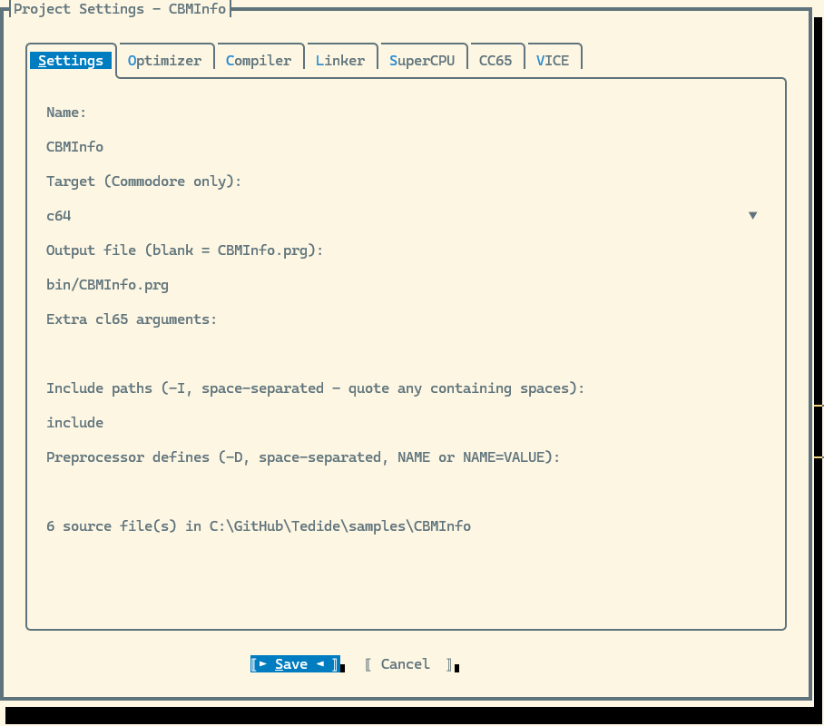
- **Optimizer** - both optimization passes a C file goes through: first the `OptimizationLevel`
  preset, with a short guide to each of cc65's `-O`/`-Oi`/`-Or`/`-Os`/`-Ox`/`-Oirs` flags, then the
  assembly optimizer below it - see **opt6502** further down.

  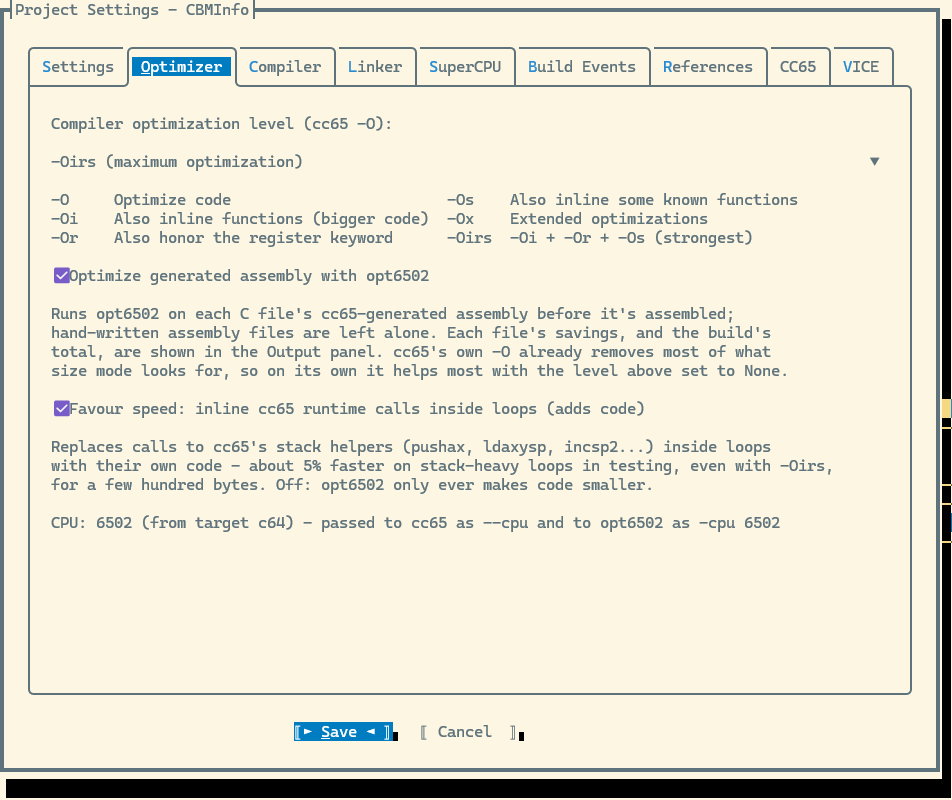
- **Compiler** - two checkboxes: *Generate assembly listing file* (`-l`, written under the project's
  `obj/` folder, e.g. `src/Foo.c` -> `obj/src/Foo.c.lst`, and surfaced in the Solution Explorer's
  Generated Files node once at least one exists) and *Include C source as comments in generated
  assembly* (`-T`, most useful together with the listing - it interleaves each C line as a comment
  above the 6502 instructions it compiled to). Tedide builds each source file in its own `cl65`
  invocation specifically so this is one listing per source file, not one covering the whole
  project. Every build output lands in `obj/`, mirroring the source tree with the
  source's own extension kept (`foo.c` -> `obj/src/foo.c.o`, `foo.s` -> `obj/src/foo.s.o`): a C
  file is compiled to assembly there first (`cl65 -S -o obj/...`) and then assembled, never with a
  bare `cl65 -c src/foo.c` - that writes its intermediate `foo.s` beside the source and deletes it
  afterward, silently destroying a hand-written `src/foo.s`. **Clean Project** deletes those
  build outputs from `obj/` (anything else in it is left alone), plus any `.o`/`.lst` older builds left beside the sources.

  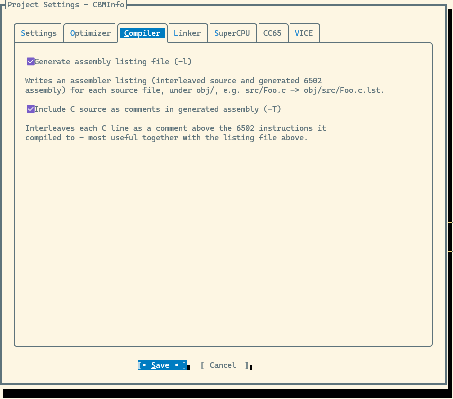
- **Linker** - *Generate linker map file* (`-m`), *Export labels* (`-Ln`), *Generate debug info*
  (`-g`/`--dbgfile` - needed for the debugger, see "Debugging" above), and a custom linker config
  file path (`-C`) - its own **Browse** button opens straight to CC65_HOME's `cfg/` folder, at the
  current Target's own default config if that specific file exists there (e.g. `vic20.cfg` for the
  VIC-20) - the same folder cc65 itself ships alternate configs in for e.g. a RAM-expanded VIC-20
  (`vic20-32k.cfg`) or Plus/4 (`c16-32k.cfg`), so picking one of those is just a matter of browsing
  rather than knowing cc65's install layout by hand. Its file-type filter defaults to just the
  current Target's own configs too (`ProjectSettingsDialog.SupportedLinkerConfigFileNames`, a
  hand-verified list per Commodore target, not a filename guess) - switch it to "All Config Files"
  in the dialog to browse for a genuinely custom-named one instead. Both the starting folder and the
  filter track the Settings tab's own Target dropdown live, the same as the SuperCPU tab below - and
  changing Target also resets this field back to blank, since a config written for one target's
  memory map is unlikely to still be valid for a different one (blank already means "use cl65's
  built-in target default", so this is the safe choice, not a written-out path that would go stale
  if CC65_HOME later changed).

  

  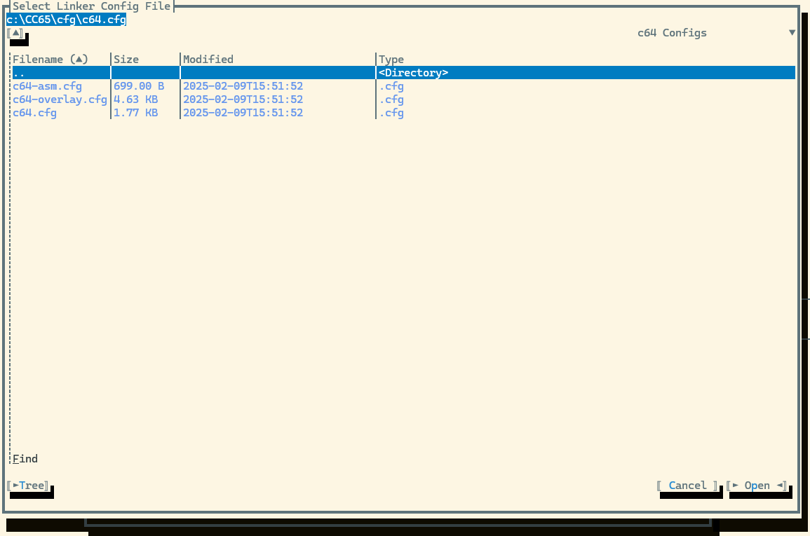
- **SuperCPU** - a single *Enable SuperCPU support* checkbox (`EnableSuperCpu`) - greyed out (and
  force-unchecked) unless the Settings tab's own Target is C64, since the SuperCPU is a C64-specific
  accelerator cartridge; kept in sync live if you change Target while this dialog is still open, not
  just from whatever it was when the dialog opened. While on, Build > Run Project and Debug > Start
  Debugging launch VICE's dedicated `xscpu64.exe` instead of `x64sc.exe`, and the project is
  compiled and assembled for the SuperCPU's 65816 (`--cpu 65816`) instead of the 6502 - so the
  result needs a SuperCPU (or `xscpu64`) to run.

  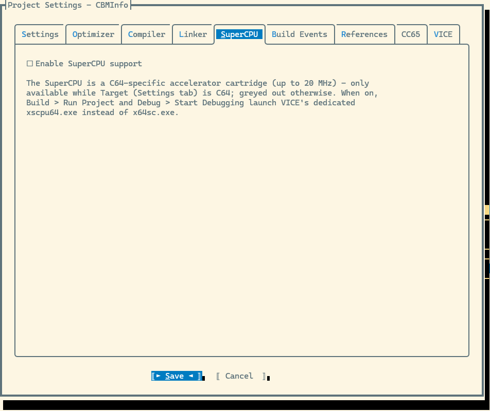
- **opt6502** (the lower half of the Optimizer tab) - *Optimize generated assembly with opt6502* (`UseOpt6502`), *Favour speed*
  (`Opt6502Mode`), and a read-only line naming the CPU the build uses (following Target and the
  SuperCPU tab live). The optimizer is built into Tedide, so there's nothing to install.
  When on, each C file is compiled to `obj/src/foo.c.cc65.s`, opt6502 writes its optimized version to
  the usual `obj/src/foo.c.s`, and that's what's assembled - so the listing, the `.dbg` file and the
  debugger all see the code that actually runs. Hand-written assembly is never touched. Each file's
  result, and the build's total, appear in the Output panel:

  ```text
  opt6502: src/editor.c: 27 optimizations (4 repeated constant load, 23 jump to next line), ~77 bytes and ~77 cycles saved
  opt6502: total for 7 C files: 44 optimizations (6 repeated constant load, 36 jump to next line, 2 unreachable instruction), ~126 bytes and ~126 cycles saved
  ```

  Byte and cycle counts are opt6502's estimates from each changed instruction's addressing mode.
  For a SuperCPU project it also replaces `LDA #0` + `STA` with `STZ` where that's provably safe.
  cc65's own `-O` already removes most of the same patterns, so on its own it helps most with the
  Optimizer tab set to None.

  *Favour speed* (`Opt6502Mode: Speed`) also replaces calls to 57 of cc65's short runtime helpers
  (`pushax`, `ldaxysp`, `incsp2`, `tosicmp`, `addeqysp`, ...) inside loops with the helpers' own
  code. That saves 9-15 cycles per call on every pass round the loop, for a few hundred bytes more
  code. cc65 always calls these helpers, so this still pays off on top of `-Oirs`: 5% fewer
  cycles on a stack-heavy test program (10% without cc65 optimization). It's checked for identical
  results in cc65's simulator, including a test of every inlined helper's register and flag
  results. The Output panel then reports bytes *added* alongside cycles saved. Off (the default),
  opt6502 only ever makes code smaller.

  The optimizer lives in `src/Tedide.Build/Opt6502` - its `README.md` lists every rule, why each is
  safe, and how it's tested. It began as a patched fork of
  [CTalkobt/opt6502](https://github.com/CTalkobt/opt6502), whose release couldn't assemble cc65
  output and miscompiled several patterns; Tedide's version is an MIT reimplementation, checked
  byte-for-byte against that fork before it was removed.
- **Build Events** - commands to run before compiling (`PreBuildCommands`) and after a successful
  link (`PostBuildCommands`), one per line.
  - Each runs through `cmd.exe` in the project folder. Its output goes to the Output panel after a
    `prebuild>`/`postbuild>` echo of the command.
  - A failing command fails the build and shows in the Error List. A failing pre-build command stops
    the build before anything is compiled.
  - Visual Studio-style macros are expanded first: `$(ProjectDir)`, `$(ProjectName)`,
    `$(OutputFile)`, `$(OutputDir)`, `$(OutputName)` and `$(Target)`.

  For example, to put the program on a `.d64` disk image with VICE's `c1541` after every build:

  ```text
  c1541 -format "game,01" d64 game.d64 -write "$(OutputFile)" game
  ```
- **References** - the library projects this one links against, as check boxes - see "Solutions
  with several projects" above.

- **CC65** - the `CC65_HOME` environment variable (where cl65 finds target headers/libraries) -
  a per-machine toolchain setting, not project state, so it's saved once and applies to every
  project (see "Prerequisites" above).

  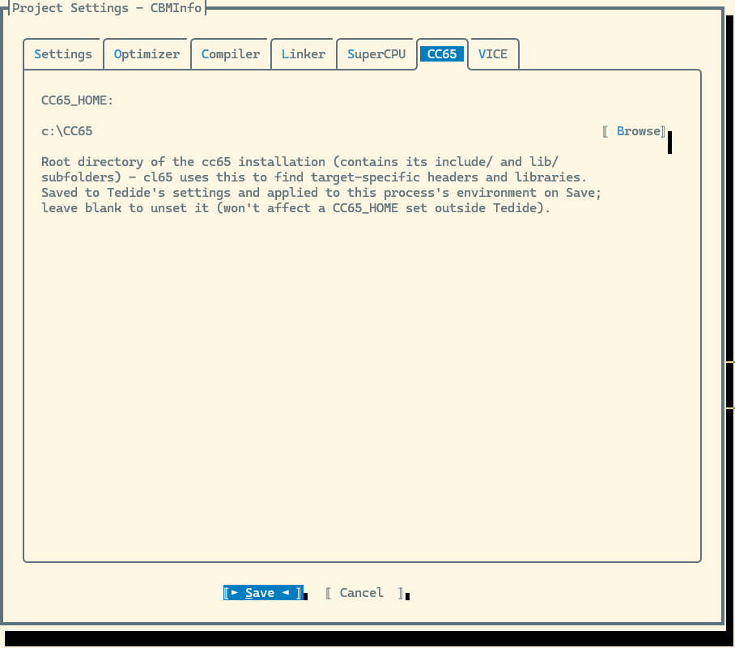
- **VICE** - the VICE bin directory - likewise per-machine, not project state (see "Prerequisites"
  above).

  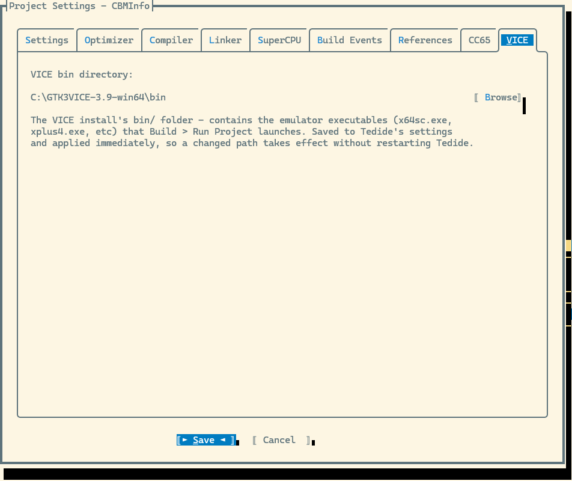

Saving writes every project-bound field (all tabs except CC65/VICE, which are per-machine settings
saved separately) to the `.tproj` in one go. If the display name changed, the project's own folder
(and its `.tproj` file) is renamed to match - e.g. renaming "HelloGame" to "SuperGame" moves
`.../HelloGame/` to `.../SuperGame/` and `HelloGame.tproj` to `SuperGame.tproj` within it,
following the same "folder named after the project" convention File > New Project scaffolds.
Source files move along with the folder, so `SourceFiles` needs no changes; if the project belongs
to a solution, the solution's own reference to it is updated too. If a folder with the new name
already exists, the name change is still saved but the folder itself is left alone and an error
explains why.

## Editing

Source files open in a [`Terminal.Gui.Editor`](https://github.com/tui-cs/Editor) `Editor` view
(line numbers, folding support, undo/redo), not a plain text box. Syntax highlighting is applied
by file extension via `HighlightingManager.GetDefinitionByExtension` - `.c`/`.h` map to the
bundled C++ definition (close enough for C keywords), and `.s`/`.asm` get a hand-written 6502/ca65
definition of Tedide's own (`Tedide.App.Highlighting.Cc65AssemblyHighlighting`), covering line
comments, string/character literals, ca65 directives, labels (including ca65's `@cheap` local
labels), numeric literals (hex/binary/decimal) and the 56 official 6502 mnemonics plus the 65C02
additions (`bra`, `phx`, `stz`...), since Terminal.Gui.Editor ships nothing for 6502 assembly
itself. `.lst` gets a third definition built on top of that one
(`Tedide.App.Highlighting.Cc65ListingHighlighting`): each line's ca65-generated address/byte-dump
prefix (e.g. `0000A5r 1  A9 08` - see "Running" above) is its own muted color, and everything after
it - the assembled source line, including interleaved C source turned into ordinary `;`-comments
when `AddSourceAsComment` is on - is colored with the same rules as `.s`/`.asm`. `.cfg` (a custom
`ld65` linker config) gets its own definition too (`Cc65CfgHighlighting`) covering `MEMORY`/
`SEGMENTS` block keywords, attribute names/values, hex literals and `#`-comments. `lnk.map` and
`.lbl` (see "Symbols" under "Running" above) keep their own highlighters
(`Cc65LinkerMapHighlighting`/`Cc65LabelsHighlighting`) when opened directly as plain text, even
though the Symbols tab is usually the more convenient way to browse them.

Every one of these colors its tokens from the active theme rather than fixed colors: each token
kind maps to one of Terminal.Gui's code roles (keyword, type, string, number, comment, function
name...) - mnemonics as keywords, directives as types, labels as function names and so on for the
cc65 file types - and each theme gives those roles its own palette (see "Themes" below), so a C
file, an assembly file and a listing all read consistently in whichever theme is active.

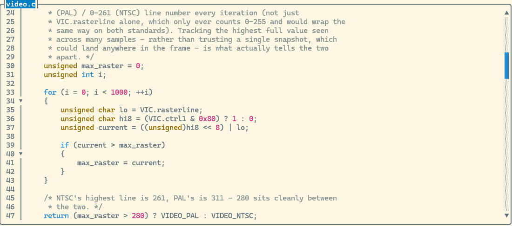

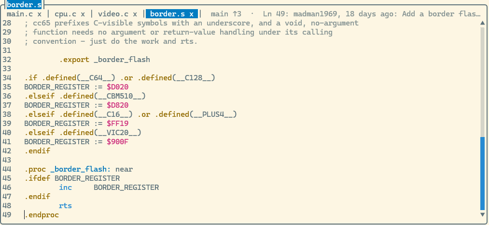

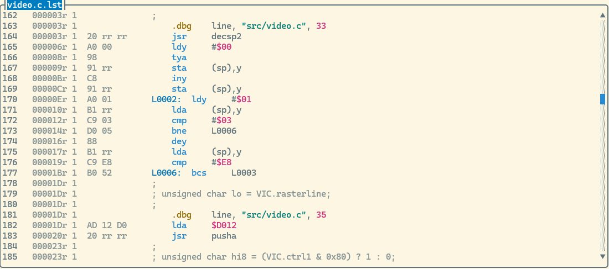

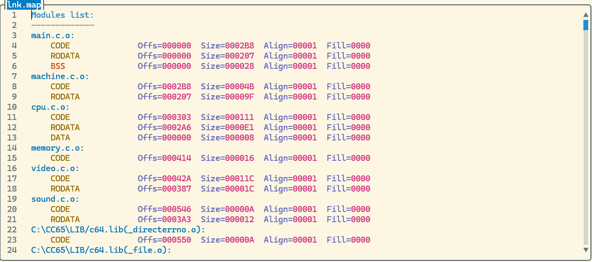

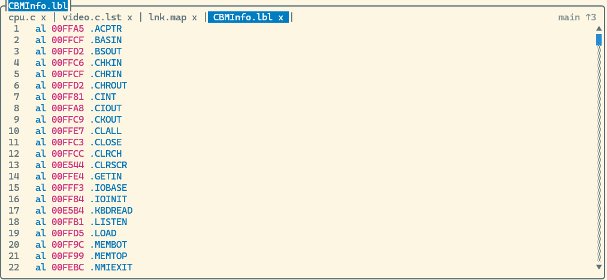

Each open file gets a tab above the editor. A `*` marks unsaved changes, and the `x` (or a
middle-click) closes the tab. Click a tab, use the mouse wheel over the strip, or press
**Ctrl+PgDn**/**Ctrl+PgUp** (**File > Next File**/**Previous File**) to switch. Selecting a file in
the Solution Explorer opens it in a new tab, or switches to its tab if it's already open.

- **Ctrl+S** saves the file being shown, and **File > Save All** saves every modified tab. A build
  saves them all first.
- Closing a tab, closing the project, opening another one, or quitting asks once about every
  unsaved tab involved.
- Renaming a file, or the project's folder, keeps its tab and any unsaved edits.
- Each project remembers its open tabs, and which one was showing, in its `.session.json` file.

`EditorPane` implements this with one `Editor` instance, constructed once and reused for the
lifetime of the app. Each tab keeps its own `TextDocument` (and so its own undo history), encoding
and caret position, and switching tabs swaps that document into the editor. With no tab open, the
editor is an empty, read-only placeholder.
This mirrors the document-swapping pattern used by Terminal.Gui.Editor's own reference app
(`tui-cs/Editor`'s "ted"), including its call to `Editor.ClearSelection()` before swapping
documents - confirmed by direct comparison against ted's source, down to matching its exact
`ConfirmSaveChanges`-style Save/Discard/Cancel flow before replacing a modified document. The
editor itself is never given a custom `Cursor`/`CursorStyle` - ted doesn't either, relying
entirely on the library's own default cursor behavior.

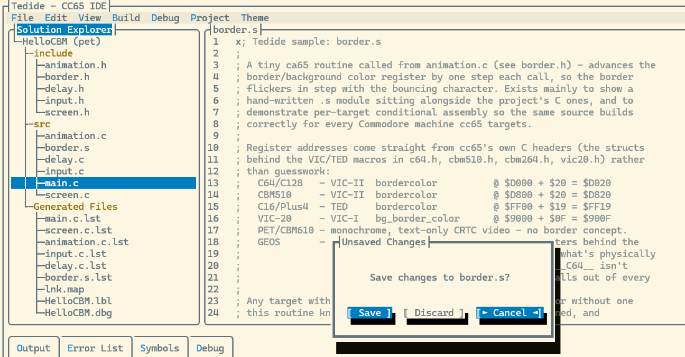

The menu and status bars are Terminal.Gui.Editor's own `EditorMenuBar`/`EditorStatusBar` - the
same components ted uses - rather than hand-rolled equivalents. Their auto-generated Edit/View
menus (Find/Replace/Undo/Redo/Cut/Copy/Paste/Select All; Line Numbers/Fold Indicators/Word Wrap/
Show Tabs/Scrollbars) and the status bar's row/column indicator (`Ln X, Col Y`, plus insert-mode
and language shortcuts) come wired to the editor already; only `EditorMenuBar`'s default File
menu is replaced with our own project-aware one (New/Open/Recent **Project**s and **Close
Solution**, rather than a single loose file - see "Running" above), a **Find in Files...** item is
appended to its own Edit menu, and Build/Project/Theme menus are added alongside it.
`EditorStatusBar`'s `ThemeDropDown` is hidden, since it drives
Terminal.Gui's own `ConfigurationManager`-based `ThemeManager` - a separate system from our own
`SchemeManager`-based theme switcher below, and leaving both active would let it silently
overwrite our custom themes.

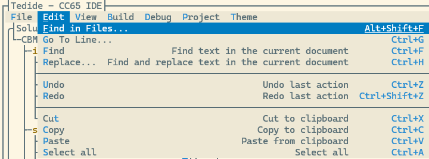

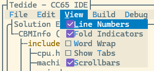

## Themes

The **Theme** menu switches between nine color themes at runtime, with no restart needed - a
checkmark next to the active one always reflects the current theme, in both Tedide.App and
Tedide.DocViewer:

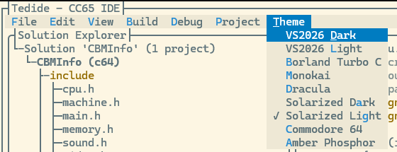

| Theme | Look |
| --- | --- |
| VS2026 Dark / VS2026 Light | Modern true-color palettes similar to current Visual Studio/VS Code themes. |
| Borland Turbo C | The classic navy-blue-background DOS IDE look, built from the 16-color ANSI palette for authenticity. |
| Monokai / Dracula | The well-known Sublime/TextMate and Dracula Theme dark palettes. |
| Solarized Dark / Solarized Light | Ethan Schoonover's low-contrast, accessibility-minded palette, both variants. |
| Commodore 64 | The C64's own boot-screen look (Pepto palette): blue background, light-blue text. |
| Amber Phosphor | A monochrome amber-on-black CRT terminal look, evoking early 6502-era terminals. |

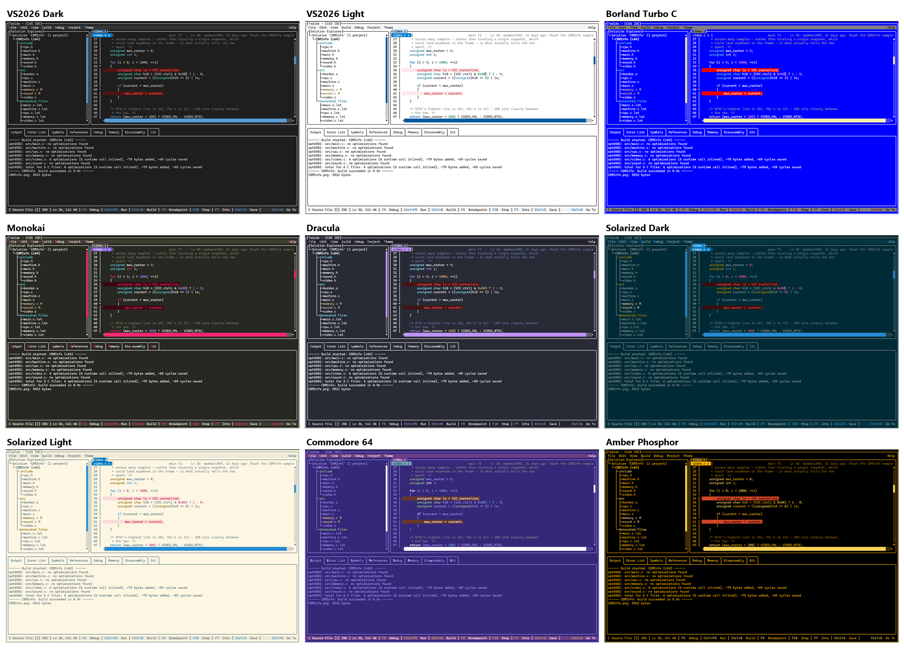

Themes are implemented in the shared `Tedide.Theming` project (`ThemeSwitcher`) by registering six
named `Scheme`s ("Base", "Menu", "Dialog", "Accent", "Error", "Warning") with Terminal.Gui's
`SchemeManager`; views resolve their scheme by name at draw time, so switching themes recolors
every open view immediately. The last-selected theme persists across runs (`ThemeSettings`, under
the OS's per-user application data folder, alongside the Recent Projects and Solutions list), and
is shared by Tedide.App and Tedide.DocViewer.

The theme covers more than the window chrome:

- **Syntax highlighting.** Each theme has its own token palette - VS Code's Dark+/Light+ colors for
  the VS2026 themes, the canonical Monokai, Dracula and Solarized accent colors, other colors from
  the real C64 palette for Commodore 64, the 16 ANSI colors for Borland, and brightness alone for
  Amber - and every file type the editor highlights (C, 6502 assembly, listings, linker maps,
  label files, linker configs) maps its tokens onto it (see "Editing" above). The Solution
  Explorer's folders and the Doc Viewer's headings and links take their colors from the same
  palette.
- **Readability.** Where a theme's own colors are too close to read comfortably, Tedide nudges the
  lightness of the text or its background (keeping the hue) until body text reaches the WCAG AA
  contrast ratio of 4.5:1, and hotkey letters, disabled text and comments reach 3:1. Where a hotkey
  letter can't be told apart from the text around it, it's underlined instead. Themes whose colors
  already pass are left exactly as designed.
- **Terminal color depth matters.** The themes are true-color. Terminal.Gui treats Windows
  Terminal as a legacy console and would draw everything in its 16 standard colors, so Tedide
  switches true color back on whenever it detects Windows Terminal (`TerminalColors`). In a classic
  console window, Terminal.Gui's own detection decides, and the true-color themes may be rounded
  to 16 colors. Borland Turbo C, Commodore 64 and Amber Phosphor look right either way, since
  they're built from a 16-color (or monochrome) palette to begin with.

## Status

In place and tested:

- **Projects** - the project/solution model; File > New Project scaffolding with the samples'
  `src`/`include`/`lib`/`bin` layout; a Recent Projects and Solutions list; the ten-tab Project
  Settings dialog, including pre- and post-build commands; a Solution Explorer folder tree with a Generated Files node and New File,
  Add Existing Item, Rename and Delete; and multi-project solutions with library projects,
  project references, a startup project, and Build/Clean Solution.
- **Editing** - a tabbed editor with syntax highlighting for C, 6502/ca65 assembly,
  assembler listings, linker maps, VICE label files and linker configs, all colored by the active
  theme; Find/Replace, Find in Files and Go To Line; Go To Definition and Find All References
  across C and assembly; Rename Symbol; Navigate Backward/Forward; and F1 context help in the Doc
  Viewer.
- **Building and running** - per-file `cl65` builds with live output, diagnostics parsed into the
  Error List, Cancel Build and Clean Project; a symbol browser for linker maps and labels; and
  Run in the VICE emulator matching the target, with the right memory configuration for the VIC-20,
  C16 and Plus/4.
- **Debugging** - source-level debugging against VICE's binary monitor protocol: breakpoints with
  persistent in-editor highlighting, conditions and a Breakpoints dialog; stepping by source line
  (Step Into runs straight through cc65's runtime library); registers with decoded status flags;
  the enclosing function name; memory watches; a Locals table of the stopped function's
  parameters and local variables with their types and values; a call stack; a stop history;
  Memory and Disassembly tabs; and a read-only editor with the current line auto-centered while a
  session is active.
- **Git** - status markers in the Solution Explorer, the branch and the caret line's blame above
  the editor, and a Git tab to stage, unstage, discard and commit.
- **Tedide.DocViewer** - the cc65 manuals and The C Book in a category tree, with full-text
  search, bookmarks, Find on Page, Back/Forward history and syntax-highlighted code blocks.
- **Themes** - nine runtime-switchable themes shared by both apps, covering syntax highlighting,
  adjusted for readability, and drawn in true color inside Windows Terminal.
- **Everything else** - file-based logging for crash diagnosis, standalone-executable publish tasks
  for both apps, and about 860 unit tests across six test projects (`dotnet test Tedide.slnx`).

Not yet implemented: a visual editor for `.cfg` linker configs
(syntax highlighting only today - see "Editing" above).

Note: this app is built against [Terminal.Gui v2](https://github.com/tui-cs/Terminal.Gui)
(`2.4.17`) and [Terminal.Gui.Editor](https://github.com/tui-cs/Editor) (`2.5.7`, pinned to that
same Terminal.Gui version), since that's the only mature C#/.NET TUI framework with the widget set
(docking panes, tree views, tabs, menus, a real code editor) this kind of IDE needs. Both are still
evolving quickly - newer development builds already exist - so expect some API changes if you bump
either package version.
